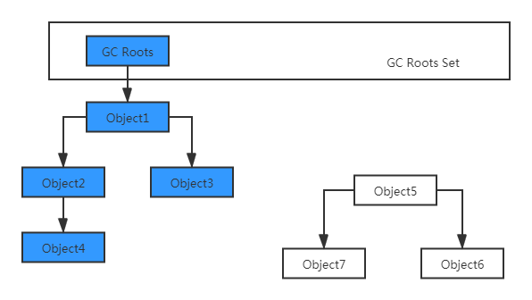
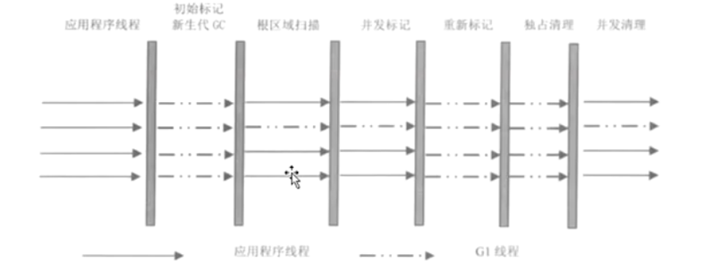

### GC垃圾回收前需要判断对象是否存活
- 引用计数算法
- 可达性分析算法(Hotspot VM采用该种算法)

下图为可达性分析算法的图解：
 

在Java中，哪些可以作为GC Roots的对象：

- 方法区：类静态属性应用的对象
- 方法区：常量引用的对象
- 虚拟机栈(本地变量表)中引用的对象
- 本地方法栈：JNI(Native方法)中引用的对象

 
### Java的引用分类

- 强引用：   
  Object obj = new Object(); 我们使用的引用基本上都是强引用
- 软引用：SoftReference    
  一些有用，但是并非必需，用软引用关联的对象，系统将要发生 `OOM` 前，这些对象就会被回收。
- 弱引用：WeakReference  
  一些有用，但是并非必须，用弱引用关联的对象，只能存活到下次垃圾回收之前，GC发生时，不管内存够不够，都会被回收  
- 虚引用：PhantomReference  
  幽灵引用，最弱，被垃圾回收的时候收到一个通知  

软引用代码实例

```java
package com.liyong.gc;

import java.lang.ref.SoftReference;
import java.util.ArrayList;
import java.util.List;

public class TestSoftReference {
	private static class User {
		private Long userId;
		private String name;
		public User(Long userId, String name) {
			super();
			this.userId = userId;
			this.name = name;
		}
	}
	
	public static void main(String[] args) {
		User user = new User(1000L, "Hello");
		// 将user对象进行软引用
		SoftReference<User> userSoft = new SoftReference<>(user);
		// 取消对user对象的引用
		user = null;
		System.out.println(userSoft.get());
		// 手动发起GC调度请求
		System.gc();
		System.out.println(userSoft.get());
		
		List<Object> list = new ArrayList<>();
		try {
			for (int i = 0; i < 10; i++) {
				System.out.println("foreach start -------: " + userSoft.get());
				// 每次放1M大小的字节到List中
				list.add(new byte[1024*1024*1]);
			}
		} catch (Throwable e) {
			e.printStackTrace();
			System.out.println("Error -------: " + userSoft.get());
		}
		
	}
}
```

JVM虚拟机参数
```shell script
-Xms5m 
-Xmx5m 
-XX:+PrintGC
```

控制台输出  
```shell script
com.liyong.gc.TestSoftReference$User@15db9742
[GC (System.gc())  820K->652K(5632K), 0.0759582 secs]
[Full GC (System.gc())  652K->550K(5632K), 0.0056969 secs]
com.liyong.gc.TestSoftReference$User@15db9742
foreach start -------: com.liyong.gc.TestSoftReference$User@15db9742
foreach start -------: com.liyong.gc.TestSoftReference$User@15db9742
foreach start -------: com.liyong.gc.TestSoftReference$User@15db9742
foreach start -------: com.liyong.gc.TestSoftReference$User@15db9742
[GC (Allocation Failure)  3661K->3782K(5632K), 0.0011918 secs]
[GC (Allocation Failure)  3782K->3718K(5632K), 0.0003072 secs]
[Full GC (Allocation Failure)  3718K->3622K(5632K), 0.0048211 secs]
[GC (Allocation Failure)  3622K->3622K(5632K), 0.0005990 secs]
[Full GC (Allocation Failure)  3622K->3600K(5632K), 0.0043405 secs]
Error -------: null
java.lang.OutOfMemoryError: Java heap space
	at com.liyong.gc.TestSoftReference.main(TestSoftReference.java:34)
```

> 手动调用了`System.gc()`后，进行了一个Full GC，再打印软引用时，引用依旧存在；
> For循环期间每次都在，当抛出OOM错误时，在catch中软引用已经为空。

弱引用  
Java代码：
```java
package com.liyong.gc;

import java.lang.ref.WeakReference;

public class TestWeakReference {
	private static class User {
		private Long userId;
		private String name;
		public User(Long userId, String name) {
			super();
			this.userId = userId;
			this.name = name;
		}
	}
	
	public static void main(String[] args) {
		User user = new User(1000L, "Hello");
		// 将user对象进行软引用
		WeakReference<User> userSoft = new WeakReference<>(user);
		// 取消对user对象的引用
		user = null;
		System.out.println(userSoft.get());
		// 手动发起GC调度请求
		System.gc();
		System.out.println(userSoft.get());
	}
}
```

输出结果  
```shell script
com.liyong.gc.TestWeakReference$User@15db9742
[GC (System.gc())  821K->684K(5632K), 0.0104242 secs]
[Full GC (System.gc())  684K->550K(5632K), 0.0155235 secs]
null
```

> 通过输出可见，在进行GC之后，弱引用就回收了

### 垃圾回收算法
标记-清除算法(Mark-Sweep)
.png) 

复制算法(Copying)
.png) 

> `标记-清除`算法会产生空间碎片，但是回收速度较快；
> `复制`算法，不会产生空间碎片，内存很整齐，但是会浪费一般空间，用于复制 

`Hotspot VM`则是使用了这两种算法

分代收集：  
 

新生代、老年代的收集器是配合使用的。  
图中的连线，代表新生代、老年代使用垃圾回收器的对应关系，新生代、老年代的垃圾回收器不是任意组合的。

> 1、老年代想使用 `CMS` 那么新生代只能使用 `Serial` `PerNew`。
> 因为CMS是标记清除算法，会发生很多空间碎片，所以经过多次GC后，因为部分空间不连续，无法被再次分配到。
> 所以当内存达到一定阀值后，`Serial Old` 会被启用，从而进行Full GC，这个时候会`Stop The World`。  
>
> 2、老年代想使用`Parallel Old`时，新生代只能使用`Parallel Scavenge`。
> 当然`Parallel Scavenge`和`Parallel Old`是JDK8的默认垃圾收集器。  
>
> 3、新生代中复制算法；而老年代CMS使用的标记清除算法； Serial Old(MSC)使用的是复制整理算法； 
> TODO 针对不同的垃圾回收机制整理实现算法
>
> 3、`G1`垃圾收集器收集所有堆空间。

根据统计，90%的对象都是朝生夕死，所以只有10%左右的对象才不会被回收。
所以在新生代中使用`标记-复制`算法的时候，并不是将所有内存一分为二的。

新生代分： Eden / Survivor  有两个Survivor   

默认空间分配比例是   8:1:1  Eden : Survivor From : Survivor To  

回收过程是： Eden From  中的存活对象 复制到 To 中，回收完后， From To 区域的标识互换，即 原来的To变成了From，而原来的From变成了To

新生代的GC叫 Minor GC； 老年代GC叫Full GC

### JDK的垃圾收集器

| 收集器	| 收集对象和算法	| 收集器类型	| 说明	| 适用场景 |
| ----  |  ----         |   ----    | ----  | ----    | 
| Serial |	新生代，复制算法 |	单线程	| |	"简单高效<br>适合内存不大的情况" |
| ParNew	| 新生代，复制算法	| 并行的多线程收集器	| ParNew垃圾收集器是Serial收集器的多线程版本	| 配合CMS垃圾收集器的首选| 
| Parallel Scavenge	| 新生代，复制算法	| 并行的多线程收集器	| 类似ParNew，更加关注吞吐量。<br>达到一个可控的吞吐量<br>是Server级别多CPU机器上的默认GC方式<br>主要适合后台运算，不需要太多交互的任务| 
| Serial Old	| 老年代，标记整理算法	| 单线程		| Client模式下虚拟机使用| 
| Parallel Old	| 老年代，标记整理算法	| 并行的多线程收集器	| Parallel Scavenge收集器的老年代版本，为了配合Parallel Scavenge的面向吞吐量的特性而开发的对应组合	在注重吞吐量以及CPU密集型的场合使用| 
| CMS	| 老年代，标记清除算法	| 并发与并行收集器	| "尽可能的缩短垃圾收集时用户线程停止时间；缺点在于：<br>1、存在内存碎片<br>2、需要更多的CPU资源<br>3、浮动垃圾问题，需要更大的空间"	| 重视服务的响应速度、<br>系统停顿时间和用户体验的互联网网站或者B/S系统。<br>互联网后端目前CMS是主流的垃圾收集器| 
| G1	| 跨新生代和老年代；<br>标记整理+化整为零| 并发与并行收集器| JDK1.7才正式引入，采用分区回收的思维，<br>基本不牺牲吞吐量的前提下完成低停顿的内存回收；<br>可预测的停顿是其最大的优势。	| 面向服务端应用的垃圾收集器，目标为取代CMS| 

 

> 吞吐量 = 运行用户代码时间 / (运行用户代码时间 + 垃圾收集时间)  
> 垃圾收集时间 = 垃圾回收率 * 单词垃圾回收时间  
> 并行： 垃圾收集的多相处同时回收    
> 并发： 垃圾收集器的多线程和应用的多线程同时进行  

查看机器的JVM垃圾回收机制：  

```shell script
E:\>java -XX:+PrintCommandLineFlags -version
-XX:InitialHeapSize=266915840 -XX:MaxHeapSize=4270653440 -XX:+PrintCommandLineFlags -XX:+UseComprividualAllocation -XX:+UseParallelGC
java version "1.8.0_05"
Java(TM) SE Runtime Environment (build 1.8.0_05-b13)
Java HotSpot(TM) 64-Bit Server VM (build 25.5-b02, mixed mode)

E:\>
```

> 从结果 `-XX:+UseParallelGC` 可得出我当前PC机器的垃圾收集器是 `Parallel Scavenge` 和 `Parallel Old`

### 垃圾回收器工作示意图

- Serial / Serial Old收集器运行示意图
 

- ParNew / Serial Old收集器运行示意图
 

- Parallel Scavenge / Parallel Old收集器运行示意图


- Concurrent Mark Sweep收集器运行示意图
 

`Serial`  `Serial Old` 最古老的，单线程，独占式，成熟、单核CPU  
> -XX:+UseSerialGC 新生代 `Serial`  老年代 `Serial Old`    
> -XX:+UseParNewGC 新生代 `ParNew`  老年代 `Serial Old`  
> -XX:+UseParallelGC 新生代 `Parallel GC`  老年代 `Serial Old`  
> -XX:+UseParallelOldGC 新生代 `Parallel GC` 老年代 `Parallel Old`
> -XX:+UseConcMarkSweepGC 新生代 `ParNew` 老年代 `CMS`

`ParNew` 和 `Serial` 处理方式基本没区别，区别在于：多线程，多CPU的使用，停顿时间比Serial短  

```shell script
-XX:MaxGCPauseMills # 控制最大停顿时间
-XX:GCTimeRatio # 允许垃圾回收时间的比例 吞吐量的倒数 整数 = 19 那么允许的时间是 1 / (1 + 19) = 5%  
-XX:+UseAdaptiveSizePolicy  # 每次GC后悔重新计算Eden From To的大小，计算依据是GC过程中的GC时间、吞吐量、内存占用量
-XX:+UseParallelOldGC  # 新生代 `Parallel GC` 老年代 `Parallel Old`
```

JDK1.8默认使用 `-XX:+UseParallelGC` 垃圾收集器，该垃圾收集器默认启动了`-XX:+UseAdaptiveSizePolicy`  

> CMS 在互联网或者B/S系统的服务端，这类应用注重服务的响应速度，系统系统的停顿时间最短，以给用户代理较好的体验。所以CMS是该业务场景的最佳实践。  
> CMS (Concurrent Mark Sweep) 并发标记清除算法，他的运行过程比其他几种垃圾收集器复杂些，整个过程分4部：  
> - 初始标记 - 短暂，仅仅只是标记一下`GC Roots`能直接关联到的对象，速度很快  
> - 并发标记 - 和用户的应用程序同时进行，进行`GC Roots Tracing`的过程  
> - 重新标记 - 短暂，修正并发标记期间因用户程序继续运行而导致标记产生变动的那一部分对象重新标记，
>   这个阶段的停顿时间一般会`初始标记`的时间长，但是远比`并发标记`耗时短  
> - 并发清除 - 整个过程中耗时最长的`并发标记`和`并发清除`过程收集器线程都可以与用户线程一起工作，所以从总体上来讲，CMS收集的内存回收过程是与用户线程一起并发执行的。
>   `-XX:+UseConcMarkSweepGC`表示新生代使用ParNew，老年代使用CMS  
> 
> CMS的缺点就是会产生浮动垃圾，每次GC后，都还存在部分垃圾对象未被回收的情况。


`并发清除`过程中，用户线程继续运行，所以需要在GC时给用户线程预留足够的娙内存空间。
参数： `-XX:CMSInitialOccupyFraction` 当老年代空间使用超过这个值时启动收集 （68% ~ 92%）。
出现错误 `Concurrent Mode Failure` 系统会启动Serial Old收集。  
`-XX:UseCMSCompactAtFullCollection` （默认开启） 需要进行Full GC的时候开启内存碎片整理，无法并发。  
`-XX:CMSFullGCsBeforeCompaction` （默认0） 设置多少次不压缩的FullGC后再来一次压缩的。

  
### G1 垃圾回收器
 

G1是混合收集，新老同时收集，内存结构不像其他收集器一样划分成连续的Eden From To Old区  

 

> `-XX:+UseG1GC`  
> 特点： 并行和并发，分代收集，空间整合，整体上看是标记-整理算法，局部看是复制算法，没有空间碎片，可预测的停顿。  
>
> 初始标记 - 短暂，仅标记GC Roots能直接关联到的对象，速度快，产生一个全局停顿，都会有一次新生代GC  
>
> 根区域扫描： 扫描Survivor区可以直接到达老年代区域  
>
> `-XX:MaxGCPauseMillis` 指定目标的最大停顿时间，G1尝试调整新生代和老年代的比例，堆大小，晋升年龄  
>
> `-XX:ParallelGCThreads` GC的工作线程数量

### ZGC 垃圾收集器  

JDK11中的ZGC是一种可延展的低延迟的垃圾收集器  
- 处理TB量级的堆
- GC时间不超过10ms
- 与使用G1相比，应用吞吐量的降低不超过15%

ZGC通过技术手段把Stop The World的情况控制在仅一次，就是第一次的初始化标记才会发生，这样就不难理解为什么GC停顿时间不随着堆增大而上升了，再大的内存也能通过并发的时间去回收。  
关键技术：  
1、有色指针(Colored Pointers)  
2、加载屏障(Load Barrier)  


### Stop The World代码实例演示
Java代码

```java
package com.liyong.gc;

import java.util.LinkedList;
import java.util.List;

/**
 * 生成大量的放到老年代，并且移除引用，使其在老年代中形成大量的垃圾对象<br>
 * 一个线程一定时间间隔打印一次，通过每次打印时间间隔是否一致，来判断是否发生Stop The World
 * @author Administrator
 */
public class StopTheWorld {
	private static class PushDataThread extends Thread {
		List<byte[]> list = new LinkedList<>();
		@Override
		public void run() {
			while(true) {
				if(list.size() * 512 / 1024 / 1024 >= 990) {
					list.clear();
					System.out.println("list clear");
				}
				for (int i = 0; i < 100; i++) {
					list.add(new byte[512]);
				}
				try {
					Thread.sleep(1);
				} catch (InterruptedException e) {
					e.printStackTrace();
				}
			}
		};
	}
	
	private static class TimerThread extends Thread {
		
		@Override
		public void run() {
			long start = System.currentTimeMillis();
			while(true) {
				long times = System.currentTimeMillis() - start;
				System.out.println(times);
				try {
					Thread.sleep(100);
				} catch (InterruptedException e) {
					e.printStackTrace();
				}
			}
		};
	} 
	
	public static void main(String[] args) {
		new PushDataThread().start();
		new TimerThread().start();
	}
}
```

虚拟机配置
```shell script
-Xmx300M
-Xms300M
-XX:+UseSerialGC
-XX:+PrintGCDetails
```

> 虚拟机使用`Serial`单线程垃圾收集器，让Stop The World更明显

```shell script
 .
 .
 .
1000
1100
1200
1300
[GC (Allocation Failure) [DefNew: 81920K->10240K(92160K), 0.0375492 secs] 81920K->74273K(296960K), 0.0375961 secs] [Times: user=0.02 sys=0.03, real=0.04 secs] 
1421
 .
 .
 .
6816
[Full GC (Allocation Failure) [Tenured: 204799K->204799K(204800K), 0.1343749 secs] 296959K->296959K(296960K), [Metaspace: 3190K->3190K(1056768K)], 0.1343976 secs] [Times: user=0.13 sys=0.00, real=0.13 secs] 
[Full GC (Allocation Failure) [Tenured: 204799K->204799K(204800K), 0.1394782 secs] 296959K->296959K(296960K), [Metaspace: 3190K->3190K(1056768K)], 0.1395001 secs] [Times: user=0.14 sys=0.00, real=0.14 secs] 
6950
```

> 代码中每100毫秒打印一次，在进行 `Minor GC` `Full GC`是，打印的时间差不再是100ms的差别。 多出来的时间就是Stop The World的时间

### GC调优的目标是什么
垃圾回收尽量发生在`Minor GC`阶段，尽量不要发生在老年代，少发生`Full GC`或者不发生`Full GC`


### 内存分配与回收策略
- 对象优先在Eden分配  
    对象优先在Eden分配，如果Eden空间不足，机会发生在`Minor GC`  
- 大对象直接进入老年代  
    大对象直接进入老年代，大对象：很长的字符串和大型数组。  
    `-XX:PretenureSizeThreshold` 参数，大于这个数量直接在老年代分配，缺省值为`0`， 表示绝不会直接分配在老年代。  
- 长期存活的对象将进入老年代  
    长期存活的对象将直接进入老年代，默认是15岁，通过`-XX:MaxTenuringThreshold`可以进行设置。  
      
- 对象动态年龄判断

- 空间分配担保  
    空间分配担保： 大量的对象存活，`Survival`空间不够，只要老年代的连续空间大于新生代对象的总大小或者历次晋升的平均大小，就进行`Minor GC`，否则`Full GC`

> `Full GC` 新生代、老年代、持久带都会进行回收。

### JVM对于新生代都有哪些配置

优先级：  
高： `-XX:NewSize` `-XX:MaxNewSize`  
中： `-Xmn` (NewSize == MaxNewSize)  
低： `-XX:NewRatio` 表示比例  
> `-XX:SurvivorRatio` 标识`Eden`和`Survivor`的比例，缺省值为8 Eden:From:To = 8:1:1  
> 如果SurvivorRatio配置成2，那么 Eden:From:To = 2:1:1


新生代的内存配置实例：  
Java代码
```java
package com.liyong.gc;

public class NewSize {
	public static void main(String[] args) {
		// 1M大小
		int cap = 1 * 1024 * 1024;
		byte[] b1 = new byte[cap];
		byte[] b2 = new byte[cap];
		byte[] b3 = new byte[cap];
		byte[] b4 = new byte[cap];
		byte[] b5 = new byte[cap];
		byte[] b6 = new byte[cap];
		byte[] b7 = new byte[cap];
		byte[] b8 = new byte[cap];
		byte[] b9 = new byte[cap];
		byte[] b0 = new byte[cap];
	}
}
```

虚拟机参数：
```shell script
-Xms20m 
-Xmx20m 
-XX:+PrintGCDetails 
-Xmn2m 
-XX:SurvivorRatio=2
```

控制台结果：
```shell script
Heap
 PSYoungGen      total 1536K, used 821K [0x00000000ffe00000, 0x0000000100000000, 0x0000000100000000)
  eden space 1024K, 80% used [0x00000000ffe00000,0x00000000ffecd578,0x00000000fff00000)
  from space 512K, 0% used [0x00000000fff80000,0x00000000fff80000,0x0000000100000000)
  to   space 512K, 0% used [0x00000000fff00000,0x00000000fff00000,0x00000000fff80000)
 ParOldGen       total 18432K, used 10240K [0x00000000fec00000, 0x00000000ffe00000, 0x00000000ffe00000)
  object space 18432K, 55% used [0x00000000fec00000,0x00000000ff6000a0,0x00000000ffe00000)
 Metaspace       used 2524K, capacity 4486K, committed 4864K, reserved 1056768K
  class space    used 269K, capacity 386K, committed 512K, reserved 1048576K
```

> 因为`-Xmn2m`，新生代空间2M内存，`-XX:SurvivorRatio=2`，Eden空间太小为1M，数组都在老年代中了，Eden没有进行垃圾回收。

同样的Java代码，不同的JVM配置参数
```shell script
-Xms20m 
-Xmx20m 
-XX:+PrintGCDetails 
-Xmn8m 
-XX:SurvivorRatio=2
```

控制台结果：

```shell script
[GC (Allocation Failure) [PSYoungGen: 4012K->1704K(6144K)] 4012K->3760K(18432K), 0.0495096 secs] [Times: user=0.20 sys=0.00, real=0.06 secs] 
[GC (Allocation Failure) [PSYoungGen: 4905K->1672K(6144K)] 6961K->6800K(18432K), 0.0120790 secs] [Times: user=0.00 sys=0.00, real=0.01 secs] 
[GC (Allocation Failure) [PSYoungGen: 4775K->1672K(6144K)] 9903K->9872K(18432K), 0.0015732 secs] [Times: user=0.00 sys=0.00, real=0.00 secs] 
Heap
 PSYoungGen      total 6144K, used 2737K [0x00000000ff800000, 0x0000000100000000, 0x0000000100000000)
  eden space 4096K, 26% used [0x00000000ff800000,0x00000000ff90a558,0x00000000ffc00000)
  from space 2048K, 81% used [0x00000000ffc00000,0x00000000ffda2030,0x00000000ffe00000)
  to   space 2048K, 0% used [0x00000000ffe00000,0x00000000ffe00000,0x0000000100000000)
 ParOldGen       total 12288K, used 8200K [0x00000000fec00000, 0x00000000ff800000, 0x00000000ff800000)
  object space 12288K, 66% used [0x00000000fec00000,0x00000000ff402080,0x00000000ff800000)
 Metaspace       used 2526K, capacity 4486K, committed 4864K, reserved 1056768K
  class space    used 270K, capacity 386K, committed 512K, reserved 1048576K
```

> `-Xmn8m` `-XX:SurvivorRatio=2` 根据两个配置，所以Eden:From:To = 2 : 1 : 1 ，即Eden分配了4M的空间  
> 所以对象会优先分配到新生代，所以新生代进行了多次GC，部分放在了新生代（Eden、From中都有）、部分放在了老年代。发生了晋升。


同样的Java代码，不同的JVM配置参数
```shell script
-Xms20m 
-Xmx20m 
-XX:+PrintGCDetails 
-Xmn15m 
-XX:SurvivorRatio=8
```
控制台结果：
```shell script
Heap
 PSYoungGen      total 13824K, used 11526K [0x00000000ff100000, 0x0000000100000000, 0x0000000100000000)
  eden space 12288K, 93% used [0x00000000ff100000,0x00000000ffc41808,0x00000000ffd00000)
  from space 1536K, 0% used [0x00000000ffe80000,0x00000000ffe80000,0x0000000100000000)
  to   space 1536K, 0% used [0x00000000ffd00000,0x00000000ffd00000,0x00000000ffe80000)
 ParOldGen       total 5120K, used 0K [0x00000000fec00000, 0x00000000ff100000, 0x00000000ff100000)
  object space 5120K, 0% used [0x00000000fec00000,0x00000000fec00000,0x00000000ff100000)
 Metaspace       used 2520K, capacity 4486K, committed 4864K, reserved 1056768K
  class space    used 269K, capacity 386K, committed 512K, reserved 1048576K
```

> `-Xmn15m` `-XX:SurvivorRatio=8` Eden:From:To = 8 : 1 ： 1  Eden: 12 M  From = To = 1.5M  
> 所以From中能放下所有数据，所以没有进行过任何GC，From/To/Old的空间都为空  

JVM参数
```shell script
-Xms20m 
-Xmx20m 
-XX:+PrintGCDetails 
-XX:NewRatio=2
```

控制台结果：
```shell script
[GC (Allocation Failure) [PSYoungGen: 5086K->488K(6144K)] 5086K->4736K(19968K), 0.0052404 secs] [Times: user=0.05 sys=0.00, real=0.00 secs] 
[GC (Allocation Failure) [PSYoungGen: 5784K->440K(6144K)] 10032K->9808K(19968K), 0.0092620 secs] [Times: user=0.00 sys=0.00, real=0.01 secs] 
[Full GC (Ergonomics) [PSYoungGen: 440K->0K(6144K)] [ParOldGen: 9368K->9764K(13824K)] 9808K->9764K(19968K), [Metaspace: 2521K->2521K(1056768K)], 0.0042511 secs] [Times: user=0.00 sys=0.00, real=0.00 secs] 
Heap
 PSYoungGen      total 6144K, used 1080K [0x00000000ff980000, 0x0000000100000000, 0x0000000100000000)
  eden space 5632K, 19% used [0x00000000ff980000,0x00000000ffa8e2c8,0x00000000fff00000)
  from space 512K, 0% used [0x00000000fff80000,0x00000000fff80000,0x0000000100000000)
  to   space 512K, 0% used [0x00000000fff00000,0x00000000fff00000,0x00000000fff80000)
 ParOldGen       total 13824K, used 9764K [0x00000000fec00000, 0x00000000ff980000, 0x00000000ff980000)
  object space 13824K, 70% used [0x00000000fec00000,0x00000000ff5893a8,0x00000000ff980000)
 Metaspace       used 2527K, capacity 4486K, committed 4864K, reserved 1056768K
  class space    used 270K, capacity 386K, committed 512K, reserved 1048576K
```

> `-XX:NewRatio=2` 即新生代：老年代 = 1 ： 2  新生代分配了6.6M 老年代分配了3.4M  
> 所以即发送了Minor GC 也发生了 Full GC，新生代对象提前进入了老年代，也出现了空间分配担保

### 内存泄露和内存溢出
- 内存泄露 - 该回收的空间，没有回收，从而导致内存泄露。  
  比如：总空间10M 内存占用5M后，本来需要全部回收5M的空间，但是实际只回收了4M，剩下的1M因为代码问题，导致本该释放的空间，没有被释放掉，这就是内存泄露
- 内存溢出

内存溢出代码演示：

```java
package com.liyong.gc;

public class Stack {
	public Object[] elements;
	/** 指示器，指示当前栈顶的位置 */
	private int size = 0;
	
	private static final int CAP = 16;
	
	public Stack() {
		elements = new Object[CAP];
	}
	
	public void push(Object obj) {
		elements[size] = obj;
		size++;
	}
	
	public Object pop() {
		size--;
		return elements[size];
	}
	
	public static void main(String[] args) {
		Stack stack = new Stack();
		Object obj = new Object();
		System.out.println("obj: " + obj);
		stack.push(obj);
		
		// 数据被弹出后，栈中的对象就应该回收
		Object obj2 = stack.pop();
		System.out.println("obj2: " + obj2);
		
		// 但是实际上依旧未被回收，这种就是因为代码问题，而导致了一个对象的内存溢出
		System.out.println(stack.elements[0]);
	}
}
```

控制台：
```shell script
obj: java.lang.Object@15db9742
obj2: java.lang.Object@15db9742
java.lang.Object@15db9742
```
> `stack.pop()` 弹出对象后，`stack.elements`的数据就应该被移除，但是因为代码原因，从而内存没有真正被回收，这就是`内存溢出`


### JDK运维工具-`jps`(虚拟机进程状况工具)
`jps` 虚拟机进程状况工具

① `jps`  仅显示进程id，主类名
```shell script
C:\Users\Administrator>jps
1744 BootLanguagServerBootApp
5632
17508
17604
19736 Launcher
4552 BootLanguagServerBootApp
7944
7644 Jps
```

② `jps -q` 仅显示进程id
```shell script
C:\Users\Administrator>jps -q
1744
5632
1172
17508
17604
19736
4552
7944
```

③ `jps -l` 输出完全的包名，主类名，jar完全路径名
```shell script
C:\Users\Administrator>jps -l
1744 org.springframework.ide.vscode.boot.app.BootLanguagServerBootApp
11976 sun.tools.jps.Jps
19736 org.jetbrains.jps.cmdline.Launcher
4552 org.springframework.ide.vscode.boot.app.BootLanguagServerBootApp
```

④ `jps -v` 显示jvm参数
```shell script
C:\Users\Administrator>jps -v
1744 BootLanguagServerBootApp -Dsts.lsp.client=eclipse -Dlsp.completions.indentation.enable=true -Xmx1024m -XX:TieredStopAtLevel=1 -Xverify:none -Dspring.config .location=file:D:\dev_tools\eclipse-jee-2019-12-R-win32-x86_64\eclipse\plugins\org.springframework.tooling.boot.ls_1.14.0.201912170939\servers\spring-boot-langu age-server\BOOT-INF\classes\application.properties
```

### JDK运维工具-`jstat`(虚拟机统计信息监控工具)
`jstat`使用手册：

类加载统计：
```shell script
/ # jstat -class 7 3000 5
Loaded  Bytes  Unloaded  Bytes     Time   
 23416 55310.2      653   948.7      52.86
 23416 55310.2      653   948.7      52.86
 23416 55310.2      653   948.7      52.86
 23416 55310.2      653   948.7      52.86
 23416 55310.2      653   948.7      52.86
```
- Loaded:加载class的数量
- Bytes：所占用空间大小
- Unloaded：未加载数量
- Bytes:未加载占用空间
- Time：时间

JIT编译统计
```shell script
/ # jstat -compiler 7 3000 5
Compiled Failed Invalid   Time   FailedType FailedMethod
   51663      2       0   354.43          1 net/sf/cglib/core/MethodWrapper$MethodWrapperKey$$KeyFactoryByCGLIB$$d45e49f7 hashCode
   51663      2       0   354.43          1 net/sf/cglib/core/MethodWrapper$MethodWrapperKey$$KeyFactoryByCGLIB$$d45e49f7 hashCode
   51663      2       0   354.43          1 net/sf/cglib/core/MethodWrapper$MethodWrapperKey$$KeyFactoryByCGLIB$$d45e49f7 hashCode
   51663      2       0   354.43          1 net/sf/cglib/core/MethodWrapper$MethodWrapperKey$$KeyFactoryByCGLIB$$d45e49f7 hashCode
   51663      2       0   354.43          1 net/sf/cglib/core/MethodWrapper$MethodWrapperKey$$KeyFactoryByCGLIB$$d45e49f7 hashCode
```
- Compiled：编译数量。
- Failed：失败数量
- Invalid：不可用数量
- Time：时间
- FailedType：失败类型
- FailedMethod：失败的方法

垃圾回收统计
```shell script
/ # jstat -gc 7 3000 5
 S0C    S1C     S0U    S1U      EC       EU        OC         OU       MC       MU       CCSC    CCSU     YGC     YGCT    FGC    FGCT     GCT   
58752.0 58752.0  0.0   58752.0 470144.0 202212.5 1167376.0   677653.7  204160.0 191553.6 18816.0 15822.8  38221 1705.665  259   312.731 2018.395
58752.0 58752.0  0.0   58752.0 470144.0 408838.6 1167376.0   677653.7  204160.0 191553.6 18816.0 15822.8  38221 1705.665  259   312.731 2018.395
58752.0 58752.0 2574.6  0.0    470144.0 14154.0  1167376.0   732998.6  204160.0 191553.6 18816.0 15822.8  38222 1705.770  259   312.731 2018.501
58752.0 58752.0 2574.6  0.0    470144.0 68680.6  1167376.0   732998.6  204160.0 191553.6 18816.0 15822.8  38222 1705.770  259   312.731 2018.501
58752.0 58752.0 2574.6  0.0    470144.0 140677.7 1167376.0   732998.6  204160.0 191553.6 18816.0 15822.8  38222 1705.770  259   312.731 2018.501
```
- S0C：Survivor 0 的大小
- S1C：Survivor 1 的大小
- S0U：Survivor 0 的使用大小
- S1U：Survivor 1 的使用大小
- EC：Eden 的大小
- EU：Eden 的使用大小
- OC：Old 大小
- OU：Old 使用大小
- MC：Metaspace 大小
- MU：Metaspace 使用大小
- CCSC:压缩类空间大小
- CCSU:压缩类空间使用大小
- YGC：Minor GC 次数
- YGCT：Minor GC 消耗时间
- FGC：Full GC 次数
- FGCT：Full GC 消耗时间
- GCT： GC 消耗总时间

堆内存统计
```shell script
/ # jstat -gccapacity 7 3000 5
 NGCMN    NGCMX     NGC     S0C     S1C       EC       OGCMN      OGCMX       OGC         OC          MCMN  MCMX      MC         CCSMN   CCSMX     CCSC    YGC    FGC 
174720.0 1747584.0 587648.0 58752.0 58752.0 470144.0   349568.0  3495296.0  1167376.0  1167376.0      0.0 1234944.0 204160.0      0.0 1048576.0  18816.0  38247   259
174720.0 1747584.0 587648.0 58752.0 58752.0 470144.0   349568.0  3495296.0  1167376.0  1167376.0      0.0 1234944.0 204160.0      0.0 1048576.0  18816.0  38247   259
174720.0 1747584.0 587648.0 58752.0 58752.0 470144.0   349568.0  3495296.0  1167376.0  1167376.0      0.0 1234944.0 204160.0      0.0 1048576.0  18816.0  38247   259
174720.0 1747584.0 587648.0 58752.0 58752.0 470144.0   349568.0  3495296.0  1167376.0  1167376.0      0.0 1234944.0 204160.0      0.0 1048576.0  18816.0  38247   259
174720.0 1747584.0 587648.0 58752.0 58752.0 470144.0   349568.0  3495296.0  1167376.0  1167376.0      0.0 1234944.0 204160.0      0.0 1048576.0  18816.0  38247   259
```
- `NGCMN`：新生代最小容量
- `NGCMX`：新生代最大容量
- `NGC`：当前新生代容量
- `S0C`：第一个幸存区大小
- `S1C`：第二个幸存区的大小
- `EC`：Eden的大小
- `OGCMN`：老年代最小容量
- `OGCMX`：老年代最大容量
- `OGC`：当前老年代大小
- `OC`:当前老年代大小
- `MCMN`:最小元数据容量
- `MCMX`：最大元数据容量
- `MC`：当前元数据空间大小
- `CCSMN`：最小压缩类空间大小
- `CCSMX`：最大压缩类空间大小
- `CCSC`：当前压缩类空间大小
- `YGC`：年轻代gc次数
- `FGC`：老年代GC次数

新生代垃圾回收统计
```shell script
/ # jstat -gcnew 7 3000 5
 S0C    S1C        S0U  S1U   TT MTT  DSS      EC       EU      YGC     YGCT  
58752.0 58752.0    0.0 3554.8 15  15 29376.0 470144.0 173220.9  38269 1707.932
58752.0 58752.0    0.0 3554.8 15  15 29376.0 470144.0 185300.6  38269 1707.932
58752.0 58752.0    0.0 3554.8 15  15 29376.0 470144.0 244999.2  38269 1707.932
58752.0 58752.0    0.0 3554.8 15  15 29376.0 470144.0 273372.8  38269 1707.932
58752.0 58752.0    0.0 3554.8 15  15 29376.0 470144.0 338777.0  38269 1707.932
```
- `S0C`：第一个幸存区大小
- `S1C`：第二个幸存区的大小
- `S0U`：第一个幸存区的使用大小
- `S1U`：第二个幸存区的使用大小
- `TT:`对象在新生代存活的次数
- `MTT`:对象在新生代存活的最大次数
- `DSS`:期望的幸存区大小
- `EC`：Eden 的大小
- `EU`：Eden 的使用大小
- `YGC`：Minor GC 次数
- `YGCT`：Minor GC 消耗时间

新生代内存统计
```shell script
/ # jstat -gcnewcapacity 7 3000 5
NGCMN      NGCMX       NGC      S0CMX     S0C     S1CMX     S1C       ECMX        EC      YGC   FGC 
174720.0  1747584.0   587648.0 174720.0  58752.0 174720.0  58752.0  1398144.0   470144.0 38480   260
174720.0  1747584.0   587648.0 174720.0  58752.0 174720.0  58752.0  1398144.0   470144.0 38481   260
174720.0  1747584.0   587648.0 174720.0  58752.0 174720.0  58752.0  1398144.0   470144.0 38482   260
174720.0  1747584.0   587648.0 174720.0  58752.0 174720.0  58752.0  1398144.0   470144.0 38484   260
174720.0  1747584.0   587648.0 174720.0  58752.0 174720.0  58752.0  1398144.0   470144.0 38485   260
```
- `NGCMN`：新生代最小容量
- `NGCMX`：新生代最大容量
- `NGC`：当前新生代容量
- `S0CMX`：最大幸存1区大小
- `S0C`：当前幸存1区大小
- `S1CMX`：最大幸存2区大小
- `S1C`：当前幸存2区大小
- `ECMX`：Eden 最大大小
- `EC`：Eden 当前大小
- `YGC`：Minor GC 次数
- `FGC`：Full GC 次数

老年代垃圾回收统计
```shell script
/ # jstat -gcold 7 3000 5
   MC       MU      CCSC     CCSU       OC          OU       YGC    FGC    FGCT     GCT   
204160.0 191558.5  18816.0  15822.8   1167376.0   1054957.5  38503   260  313.908 2033.062
204160.0 191558.5  18816.0  15822.8   1167376.0   1054957.5  38504   260  313.908 2033.093
204160.0 191558.5  18816.0  15822.8   1167376.0   1054957.5  38504   260  313.908 2033.093
204160.0 191558.5  18816.0  15822.8   1167376.0   1054957.5  38504   260  313.908 2033.093
204160.0 191558.5  18816.0  15822.8   1167376.0   1054957.5  38504   260  313.908 2033.093
```
- `MC`：方法区大小
- `MU`：方法区使用大小
- `CCSC`:压缩类空间大小
- `CCSU`:压缩类空间使用大小
- `OC`：老年代大小
- `OU`：老年代使用大小
- `YGC`：年轻代垃圾回收次数
- `FGC`：老年代垃圾回收次数
- `FGCT`：老年代垃圾回收消耗时间
- `GCT`：垃圾回收消耗总时间

老年代内存统计
```shell script
/ # jstat -gcoldcapacity 7 3000 5
   OGCMN       OGCMX        OGC         OC       YGC   FGC    FGCT     GCT   
   349568.0   3495296.0   1167376.0   1167376.0 38508   260  313.908 2033.177
   349568.0   3495296.0   1167376.0   1167376.0 38509   260  313.908 2033.208
   349568.0   3495296.0   1167376.0   1167376.0 38509   260  313.908 2033.208
   349568.0   3495296.0   1167376.0   1167376.0 38509   260  313.908 2033.208
   349568.0   3495296.0   1167376.0   1167376.0 38509   260  313.908 2033.208
```
- `OGCMN`：老年代最小容量
- `OGCMX`：老年代最大容量
- `OGC`：当前老年代大小
- `OC`：老年代大小
- `YGC`：年轻代垃圾回收次数
- `FGC`：老年代垃圾回收次数
- `FGCT`：老年代垃圾回收消耗时间
- `GCT`：垃圾回收消耗总时间

元数据空间统计
```shell script
/ # jstat -gcmetacapacity 7 3000 5
   MCMN      MCMX        MC        CCSMN     CCSMX      CCSC    YGC   FGC    FGCT     GCT   
   0.0  1234944.0   204160.0        0.0  1048576.0    18816.0 38518   260  313.908 2033.770
   0.0  1234944.0   204160.0        0.0  1048576.0    18816.0 38518   260  313.908 2033.770
   0.0  1234944.0   204160.0        0.0  1048576.0    18816.0 38518   260  313.908 2033.770
   0.0  1234944.0   204160.0        0.0  1048576.0    18816.0 38518   260  313.908 2033.770
   0.0  1234944.0   204160.0        0.0  1048576.0    18816.0 38518   260  313.908 2033.770
``` 
- `MCMN`: 最小元数据容量
- `MCMX`：最大元数据容量
- `MC`：当前元数据空间大小
- `CCSMN`：最小压缩类空间大小
- `CCSMX`：最大压缩类空间大小
- `CCSC`：当前压缩类空间大小
- `YGC`：年轻代垃圾回收次数
- `FGC`：老年代垃圾回收次数
- `FGCT`：老年代垃圾回收消耗时间
- `GCT`：垃圾回收消耗总时间

总结垃圾回收统计
```shell script
/ # jstat -gcutil 7 3000 5
  S0     S1     E      O      M     CCS    YGC     YGCT    FGC    FGCT     GCT   
  0.00  26.80  98.08  44.26  93.84  84.11  38527 1720.484   261  315.102 2035.586
 25.42   0.00   9.25  44.26  93.84  84.11  38528 1720.518   261  315.102 2035.620
 25.42   0.00  18.13  44.26  93.84  84.11  38528 1720.518   261  315.102 2035.620
 25.42   0.00  29.06  44.26  93.84  84.11  38528 1720.518   261  315.102 2035.620
 25.42   0.00  43.33  44.26  93.84  84.11  38528 1720.518   261  315.102 2035.620
```
- `S0`：幸存1区当前使用比例
- `S1`：幸存2区当前使用比例
- `E`：Eden 使用比例
- `O`：老年代使用比例
- `M`：元数据区使用比例
- `CCS`：压缩使用比例
- `YGC`：年轻代垃圾回收次数
- `FGC`：老年代垃圾回收次数
- `FGCT`：老年代垃圾回收消耗时间
- `GCT`：垃圾回收消耗总时间

JVM编译方法统计
```shell script
/ # jstat -printcompilation 7 3000 5
Compiled  Size  Type Method
   51691    670    1 sun/nio/cs/ext/ExtendedCharsets init
   51691    670    1 sun/nio/cs/ext/ExtendedCharsets init
   51691    670    1 sun/nio/cs/ext/ExtendedCharsets init
   51691    670    1 sun/nio/cs/ext/ExtendedCharsets init
   51691    670    1 sun/nio/cs/ext/ExtendedCharsets init
```
- `Compiled`：最近编译方法的数量
- `Size`：最近编译方法的字节码数量
- `Type`：最近编译方法的编译类型。
- `Method`：方法名标识。

### JDK运维工具 - `jinfo`(Java配置信息工具)
命令格式
```shell script
jinfo [option] pid
```

选项  
option具体选项及作用如下：  
> -flags 查看jvm的参数  
> -sysprops 查看java系统参数  
> flag [+|-] 修改正在运行的Java应用程序JVM参数，其中+是开启对应参数，-是关闭对应参数  

- -flags 查看jvm参数

```shell script
/ # jinfo -flags 7
Attaching to process ID 7, please wait...
Debugger attached successfully.
Server compiler detected.
JVM version is 25.192-b12
Non-default VM flags: -XX:CICompilerCount=2 -XX:InitialHeapSize=536870912 -XX:+ManagementServer -XX:MaxHeapSize=5368709120 -XX:MaxNewSize=1789526016 -XX:MinHeapDeltaBytes=196608 -XX:NewSize=178913280 -XX:OldSize=357957632 -XX:+UseCompressedClassPointers -XX:+UseCompressedOops -XX:+UseFastUnorderedTimeStamps 
Command line:  -Dcom.sun.management.jmxremote.port=1099 -Dcom.sun.management.jmxremote.ssl=false -Dcom.sun.management.jmxremote.authenticate=false -Djava.rmi.server.hostname=127.0.0.1 -Duser.timezone=GMT+8 -Xms512m -Xmx5120m -XX:PermSize=512M -XX:MaxPermSize=1024m -Djava.security.egd=file:/dev/./urandom
```

- -sysprops 查看java系统参数
```shell script
/ # jinfo -sysprops 7
Attaching to process ID 7, please wait...
Debugger attached successfully.
Server compiler detected.
JVM version is 25.192-b12
com.sun.management.jmxremote.authenticate = false
java.runtime.name = Java(TM) SE Runtime Environment
java.vm.version = 25.192-b12
sun.boot.library.path = /usr/lib/jvm/java-8-oracle/jre/lib/amd64
java.protocol.handler.pkgs = org.apache.axis.transport|
java.vendor.url = http://java.oracle.com/
java.vm.vendor = Oracle Corporation
path.separator = :
java.rmi.server.randomIDs = true
file.encoding.pkg = sun.io
java.vm.name = Java HotSpot(TM) 64-Bit Server VM
sun.os.patch.level = unknown
sun.java.launcher = SUN_STANDARD
user.dir = /opt/workspace
java.vm.specification.name = Java Virtual Machine Specification
com.sun.management.jmxremote.port = 1099
java.runtime.version = 1.8.0_192-b12
java.awt.graphicsenv = sun.awt.X11GraphicsEnvironment
os.arch = amd64
java.endorsed.dirs = /usr/lib/jvm/java-8-oracle/jre/lib/endorsed
line.separator = 

java.io.tmpdir = /tmp
java.vm.specification.vendor = Oracle Corporation
os.name = Linux
sun.jnu.encoding = UTF-8
java.library.path = /usr/java/packages/lib/amd64:/usr/lib64:/lib64:/lib:/usr/lib
java.specification.name = Java Platform API Specification
java.class.version = 52.0
sun.management.compiler = HotSpot 64-Bit Tiered Compilers
os.version = 4.17.0-1.el7.elrepo.x86_64
user.home = /root
user.timezone = GMT+8
java.awt.printerjob = sun.print.PSPrinterJob
file.encoding = UTF-8
java.specification.version = 1.8
user.name = root
java.class.path = .:/opt/workspace/classes:/opt/workspace/lib/FastInfoset-1.2.13.jar: ......... opt/workspace/lib/xstream-1.4.5.jar:/opt/workspace/lib/xwork-core-2.3.20.3.jar
java.vm.specification.version = 1.8
sun.arch.data.model = 64
sun.java.command = org.lot.taskserver.ServerStart
java.home = /usr/lib/jvm/java-8-oracle/jre
user.language = en
java.specification.vendor = Oracle Corporation
awt.toolkit = sun.awt.X11.XToolkit
com.sun.management.jmxremote.ssl = false
java.vm.info = mixed mode
java.version = 1.8.0_192
java.ext.dirs = /usr/lib/jvm/java-8-oracle/jre/lib/ext:/usr/java/packages/lib/ext
sun.boot.class.path = /usr/lib/jvm/java-8-oracle/jre/lib/resources.jar:/usr/lib/jvm/java-8-oracle/jre/lib/rt.jar:/usr/lib/jvm/java-8-oracle/jre/lib/sunrsasign.jar:/usr/lib/jvm/java-8-oracle/jre/lib/jsse.jar:/usr/lib/jvm/java-8-oracle/jre/lib/jce.jar:/usr/lib/jvm/java-8-oracle/jre/lib/charsets.jar:/usr/lib/jvm/java-8-oracle/jre/lib/jfr.jar:/usr/lib/jvm/java-8-oracle/jre/classes
java.vendor = Oracle Corporation
file.separator = /
java.security.egd = file:/dev/./urandom
java.vendor.url.bug = http://bugreport.sun.com/bugreport/
sun.io.unicode.encoding = UnicodeLittle
sun.font.fontmanager = sun.awt.X11FontManager
sun.cpu.endian = little
java.rmi.server.hostname = 127.0.0.1
sun.cpu.isalist =
```

- -flag [+|-] 开启PrintGCDetails参数
```shell script
/ # jinfo -flags 7
Attaching to process ID 7, please wait...
Debugger attached successfully.
Server compiler detected.
JVM version is 25.192-b12
Non-default VM flags: -XX:CICompilerCount=2 -XX:InitialHeapSize=536870912 -XX:+ManagementServer -XX:MaxHeapSize=5368709120 -XX:MaxNewSize=1789526016 -XX:MinHeapDeltaBytes=196608 -XX:NewSize=178913280 -XX:OldSize=357957632 -XX:+UseCompressedClassPointers -XX:+UseCompressedOops -XX:+UseFastUnorderedTimeStamps 
Command line:  -Dcom.sun.management.jmxremote.port=1099 -Dcom.sun.management.jmxremote.ssl=false -Dcom.sun.management.jmxremote.authenticate=false -Djava.rmi.server.hostname=127.0.0.1 -Duser.timezone=GMT+8 -Xms512m -Xmx5120m -XX:PermSize=512M -XX:MaxPermSize=1024m -Djava.security.egd=file:/dev/./urandom
/ # jinfo -flag +PrintGCDetails 7
/ # jinfo -flags 7
Attaching to process ID 7, please wait...
Debugger attached successfully.
Server compiler detected.
JVM version is 25.192-b12
Non-default VM flags: -XX:CICompilerCount=2 -XX:InitialHeapSize=536870912 -XX:+ManagementServer -XX:MaxHeapSize=5368709120 -XX:MaxNewSize=1789526016 -XX:MinHeapDeltaBytes=196608 -XX:NewSize=178913280 -XX:OldSize=357957632 -XX:+PrintGCDetails -XX:+UseCompressedClassPointers -XX:+UseCompressedOops -XX:+UseFastUnorderedTimeStamps 
Command line:  -Dcom.sun.management.jmxremote.port=1099 -Dcom.sun.management.jmxremote.ssl=false -Dcom.sun.management.jmxremote.authenticate=false -Djava.rmi.server.hostname=127.0.0.1 -Duser.timezone=GMT+8 -Xms512m -Xmx5120m -XX:PermSize=512M -XX:MaxPermSize=1024m -Djava.security.egd=file:/dev/./urandom
```
> 通过执行 `jinfo -flag +PrintGCDetails 7` 为进程号为7的Java程序新增了`PrintGCDetails`打印

关闭特定功能
```shell script
/ # jinfo -flag -PrintGCDetails 7
```

怎么查看哪些配置可以通过`jinfo`进行管理
```shell script
/ # java -XX:+PrintFlagsFinal -version
[Global flags]
     intx CMSTriggerInterval                        = -1                                  {manageable}
    uintx CMSTriggerRatio                           = 80                                  {product}
     intx CMSWaitDuration                           = 2000                                {manageable}
     bool HeapDumpAfterFullGC                       = false                               {manageable}
     bool HeapDumpBeforeFullGC                      = false                               {manageable}
     bool HeapDumpOnOutOfMemoryError                = false                               {manageable}
    ccstr HeapDumpPath                              =                                     {manageable}
     bool PrintClassHistogram                       = false                               {manageable}
     bool PrintClassHistogramAfterFullGC            = false                               {manageable}
     bool PrintClassHistogramBeforeFullGC           = false                               {manageable}
     bool PrintConcurrentLocks                      = false                               {manageable}
     bool PrintGC                                   = false                               {manageable}
     bool PrintGCDateStamps                         = false                               {manageable}
     bool PrintGCDetails                            = false                               {manageable}
     bool PrintGCID                                 = false                               {manageable}
     bool PrintGCTimeStamps                         = false                               {manageable}
java version "1.8.0_192"
Java(TM) SE Runtime Environment (build 1.8.0_192-b12)
Java HotSpot(TM) 64-Bit Server VM (build 25.192-b12, mixed mode)
/ # 
```
通过以上命令，`manageable` 类型的就是可以进行动态调整的

### JDK运维工具 - `jmap`(Java内存映像工具)

```shell script
jmap -dump:live,format=b,file=/test.bin 7
```

jmap一般用于获取程序的dump文件

### JDK运维工具 - `jstack`(Java堆栈跟踪工具)
 `jstack` 命令主要用来查看Java线程的调用堆栈的

`jstack` 需要再研究下，用来分析线程的问题。
https://blog.csdn.net/xiaoxiaoxuanao/article/details/52692614  
https://www.jianshu.com/p/00b0455cd69c  

  

### JDK运维工具 - JConsole（在线实时监控管理）

！！！！！！重点研究下使用

### JDK运维工具 - MAT （可以离线分析dump文件）

！！！！重点研究下使用


### 深堆和浅堆的概念
浅堆： 对象结构本身占用的内存大小  
深堆： 这个对象被GC回收后，可以真实释放的内存大小