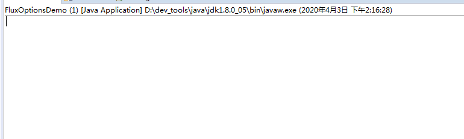

### 1、Mono实例的创建

```java
// 创建对象
Mono.just("Hello").subscribe(System.out::println);
```

```java
// 创建一个不包含任何元素，只发布结束消息的序列
Mono.empty().subscribe(System.out::println);
```

```java
// empty里面至少还有一个结束消息，而never则是真的啥都没有
Mono.never().subscribe(System.out::println);
```

```java
// 分别从  Callable、CompletionStage、CompletableFuture、Runnable 和 Supplier 中创建 Mono。
Mono.fromCallable(() -> "9999").subscribe(System.out::println);
Mono.fromCompletionStage(CompletableFuture.supplyAsync(() -> "fromCompletionStage异步返回的结果")).subscribe(System.out::println);
Mono.fromFuture(CompletableFuture.supplyAsync(() -> "fromFuture异步返回的结果")).subscribe(System.out::println);
Mono.fromRunnable(() -> {});
Mono.fromSupplier(() -> "Hello Supplier").subscribe(System.out::println);
```

```java
// 创建一个 Mono 序列，在指定的延迟时间之后，产生数字 0 作为唯一值。
Mono.delay(Duration.ofSeconds(3)).doOnNext(System.out::println).block();
```

```java

// 从一个 Optional 对象或可能为 null 的对象中创建 Mono。只有 Optional 对象中包含值或对象不为 null 时，Mono 序列才产生对应的元素。
Mono.justOrEmpty(Optional.of("Hello Optional")).subscribe(System.out::println);
```

```java
// 还可以通过 create()方法来使用 MonoSink 来创建 Mono
Mono.create(sink -> {
	sink.success("Hello create sink");
}).subscribe(System.out::println);
```

```java
// defer(Supplier supplier) 可以依赖supplier延时的提供来创建一个新的Mono
Mono.defer(() -> Mono.just("Good")).subscribe(System.out::println);
```

## 2、Flux实例的创建

```java
// 可以指定序列中包含的全部元素。创建出来的 Flux 序列在发布这些元素之后会自动结束。
Flux.just("Hello", "World").subscribe(System.out::println);
```

```java
// fromArray()，fromIterable()和 fromStream()：可以从一个数组、Iterable 对象或 Stream 对象中创建 Flux 对象。
Flux.fromArray(new Integer[] {1, 2, 3}).subscribe(System.out::println);

List<String> list = new ArrayList<>();
list.add("Y20");list.add("Y30");list.add("Y40");
Flux.fromIterable(list).subscribe(System.out::println);
```

```java
// 创建一个不包含任何元素，只发布结束消息的序列。
// 在响应式编程中，流的传递是基于元素的，empty表示没有任何元素，所以不会进行后续传递，需要用switchIfEmpty等处理
Flux.empty().subscribe(System.out::println);
```

```java

// 创建一个不包含任何消息通知的序列
Flux.range(1, 10)
	.timeout(Flux.never(), v -> Flux.never())
	.subscribe(System.out::println);
```

```java
// 创建包含从 start 起始的 count 个数量的 Integer 对象的序列。
Flux.range(55, 10).subscribe(System.out::println);
```

```java
System.out.println("-----------Flux.interval-----------");
Flux.interval(Duration.of(10, ChronoUnit.SECONDS)).subscribe(System.out::println);
```

```java
/*
 *
 * generate()方法通过同步和逐一的方式来产生 Flux 序列。
 * 序列的产生是通过调用所提供的 SynchronousSink 对象的 next()，complete()和 error(Throwable)方法来完成的。
 * 逐一生成的含义是在具体的生成逻辑中，next()方法只能最多被调用一次。
 * 在有些情况下，序列的生成可能是有状态的，需要用到某些状态对象。
 * 此时可以使用 generate()方法的另外一种形式 generate(Callable stateSupplier, BiFunction<S,SynchronousSink,S> generator)，
 * 其中 stateSupplier 用来提供初始的状态对象。在进行序列生成时，状态对象会作为 generator 使用的第一个参数传入，
 * 可以在对应的逻辑中对该状态对象进行修改以供下一次生成时使用。
 * 【Flux.generate single】通过 next()方法产生一个简单的值，然后通过 complete()方法来结束该序列。
 * 如果不调用 complete()方法，所产生的是一个无限序列。
 * 【Flux.generate murti】第二个序列的生成逻辑中的状态对象是一个 ArrayList 对象。
 * 实际产生的值是一个随机数。产生的随机数被添加到 ArrayList 中。当产生了 10 个数时，通过 complete()方法来结束序列
 */
System.out.println("-----------Flux.generate single-----------");
AtomicInteger index = new AtomicInteger(0);
Flux.generate(sink -> {
	sink.next("H1");
	if(index.getAndIncrement() == 10) {
		sink.complete();
	}
}).subscribe(System.out::println);

System.out.println("-----------Flux.generate murti-----------");
AtomicInteger index2 = new AtomicInteger(0);
Flux.generate(ArrayList::new, (datas, sink) -> {
	int value = index2.getAndIncrement();
	datas.add(value);
    sink.next(value);
    if (datas.size() == 10) {
        sink.complete();
    }
    return datas;
}).subscribe(System.out::println);
```

```java
// create()方法与 generate()方法的不同之处在于所使用的是 FluxSink 对象。
// FluxSink 支持同步和异步的消息产生，并且可以在一次调用中产生多个元素。
// 重点说明，subscribe提供的consumer必须保证幂等性，否则失败重试，会导致重复消费。
System.out.println("-----------Flux.create-----------");
Flux.create(sink -> {
	for (int i = 0; i < 10; i++) {
        sink.next(i);
        try {
			Thread.sleep(10);
		} catch (InterruptedException e) {
			e.printStackTrace();
		}
    }
	sink.complete();
}).subscribe(System.out::println);
```

### 3、Mono、Flux的操作符及其功能

buffer、bufferTimeout、bufferMillis、bufferTimeoutMillis、bufferUntil、bufferWhile

>
这两个操作符的作用是把当前流中的元素收集到集合中，并把集合对象作为流中的新元素。  
在进行收集时可以指定不同的条件：所包含的元素的最大数量和收集的时间。  
方法 buffer()仅使用一个条件，而 bufferTimeout()可以同时指定两个条件。  
指定时间间隔时可以使用 Duration 对象或毫秒数，即使用 bufferMillis()或 bufferTimeoutMillis()两个方法。  
除了元素数量和时间之外，还可以通过 bufferUntil 和 bufferWhile 操作符来进行收集。  
这两个操作符的参数是表示每个集合中的元素所要满足的条件的 Predicate 对象。  
bufferUntil 会一直收集直到 Predicate 返回为 true。  
使得 Predicate 返回 true 的那个元素可以选择添加到当前集合或下一个集合中；  
bufferWhile 则只有当 Predicate 返回 true 时才会收集，一旦值为 false，会立即开始下一次收集  
 

> buffer bufferTimeout bufferUntil bufferUntil bufferWhile 共同的目的就是对数据进行缓冲，让一次消费处理更多的


```java
System.out.println("-----------Flux.create buffer-----------");
Flux.create(sink -> {
	for (int i = 0; i < 20; i++) {
        sink.next(i);
        try {
			Thread.sleep(100);
		} catch (InterruptedException e) {
			e.printStackTrace();
		}
    }
	sink.complete();
}).buffer(5).subscribe(System.out::println);

Flux.range(1, 100).buffer(10).subscribe(System.out::println);

System.out.println("-----------Flux.create bufferTimeout-----------");
Flux.create(sink -> {
	for (int i = 0; i < 20; i++) {
        sink.next(i);
        try {
			Thread.sleep(500);
		} catch (InterruptedException e) {
			e.printStackTrace();
		}
    }
	sink.complete();
}).bufferTimeout(5, Duration.ofSeconds(2)).subscribe(System.out::println);

System.out.println("-----------Flux.range bufferWhile-----------");
Flux.range(1, 10).bufferWhile(data -> data%4 == 0).subscribe(System.out::println);

System.out.println("-----------Flux.range bufferUntil-----------");
Flux.range(1, 10).bufferUntil(data -> data%4 == 0).subscribe(System.out::println);
```

window

>
window 操作符的作用类似于 buffer，所不同的是 window 操作符是把当前流中的元素收集到另外的 Flux 序列中，  
因此返回值类型是 Flux<Flux>。  
window可以指定个数截取，也可以根据时间片进行截取（时间窗口）  


```java
/*
 * window 操作符的作用类似于 buffer，所不同的是 window 操作符是把当前流中的元素收集到另外的 Flux 序列中，
 * 因此返回值类型是 Flux<Flux>。
 * window可以指定个数截取，也可以根据时间片进行截取（时间窗口）
 */
System.out.println("-----------Flux.range window-----------");
//  subscribe里面订阅到的数据其实是，Flux<T>，所以我们在该对象上再次订阅了
Flux.range(1, 100).window(20).subscribe(flux -> flux.subscribe(System.out::println));
Flux.interval(Duration.ofMillis(100)).window(Duration.ofMillis(1001)).subscribe(System.out::println);
// 由于上面一行代码我们没有Limit，并且它是异步处理发布订阅，这里通过控制台输入来挂住主线程，让其可以持续生产、消费数据
System.in.read();
```

filter

>
filter 对流中包含的元素进行过滤，只留下满足 Predicate 指定条件的元素  

```java
// filter 对流中包含的元素进行过滤，只留下满足 Predicate 指定条件的元素
System.out.println("-----------Flux.range filter-----------");
Flux.range(1, 10).filter(i -> i % 2 == 0).subscribe(System.out::println);
```

zipWith

>
zipWith 操作符把当前流中的元素与另外一个流中的元素按照一对一的方式进行合并。  
在合并时可以不做任何处理，由此得到的是一个元素类型为 Tuple2 的流；  
也可以通过一个 BiFunction 函数对合并的元素进行处理，所得到的流的元素类型为该函数的返回值。  


```java
/*
 * zipWith 操作符把当前流中的元素与另外一个流中的元素按照一对一的方式进行合并。
 * 在合并时可以不做任何处理，由此得到的是一个元素类型为 Tuple2 的流；
 * 也可以通过一个 BiFunction 函数对合并的元素进行处理，所得到的流的元素类型为该函数的返回值。
 */
System.out.println("-----------Flux zipWith-----------");
/*
 * [a,c]
 * [b,d]
 */
Flux.just("a", "b").zipWith(Flux.just("c", "d")).subscribe(System.out::println);

/*
 * a -> c
 * b -> d
 */
System.out.println("-----------Flux zipWith combine-----------");
Flux.just("a", "b").zipWith(Flux.just("c", "d", "e"), (data1, data2) -> {
	return data1 + " -> " + data2;
}).subscribe(System.out::println);

Mono.just(new ResponseBuilder())
	//.publishOn(Schedulers.elastic())
	.subscribeOn(Schedulers.elastic())
	.zipWith(new ServiceA().queryAa())
	.zipWith(new ServiceB().queryBb(), (builderAndResultAa, resultBb) -> {
		// 模拟经过一系列的处理，最终得到我们需要的数据对象，并返回
		ResponseBuilder builder = builderAndResultAa.getT1();
		String result1 = builder.build(builderAndResultAa.getT2());
		String result2 = builder.build(resultBb);
		System.out.println(result1 + result2);
		System.out.println("数据校验，数据处理完成");
		return 100;
	}).subscribe((data) -> {
		// 将数据存盘
		new LocalDbService().save(data);
		System.out.println("存盘完成");
	}, err -> {
		
	}, () -> {
		System.out.println("通知完成");
		// 处理完成后发消息到其他系统进行通知
	});

```

```java
static class ResponseBuilder {
	public String build(String data) {
		return "[<-" + data + "->]";
	}
}

static class LocalDbService {
	Mono<Boolean> save(int data) {
		// 支持响应处理的数据库进行存盘操作
		return Mono.just(Boolean.TRUE);
	}
}

static class ServiceA {
	Mono<String> queryAa() {
		// 响应式操作，比如向服务A发起了一个查询获取到查询结果
		return Mono.just("AAAAA");
	}
}

static class ServiceB {
	Mono<String> queryBb() {
		// 响应式操作，比如向服务B发起了一个查询获取到查询结果
		return Mono.just("BBBBB");
	}
}
```

take

>take 系列操作符用来从当前流中提取元素  

```java
/*
 * take 系列操作符用来从当前流中提取元素
 */
// take 按照指定的数量或时间间隔来提取
System.out.println("-----------Flux range take-----------");
Flux.range(1, 1000).take(10).subscribe(System.out::println);

// 提取流中的最后 N 个元素
System.out.println("-----------Flux range takeLast-----------");
Flux.range(1, 1000).takeLast(10).subscribe(System.out::println);

// 当 Predicate 返回 true 时才进行提取
System.out.println("-----------Flux range takeWhile-----------");
Flux.range(1, 1000).takeWhile(i -> i < 10).subscribe(System.out::println);

// 提取元素直到 Predicate 返回 true
System.out.println("-----------Flux range takeUntil-----------");
Flux.range(1, 1000).takeUntil(i -> i == 10).subscribe(System.out::println);

// 提取元素直到另外一个流开始产生元素
// takeUntilOther(Publisher<?> other)
System.in.read();
```

reduce、reduceWith

>
reduce 和 reduceWith 操作符对流中包含的所有元素进行累积操作，得到一个包含计算结果的 Mono 序列。  
累积操作是通过一个 BiFunction 来表示的。  
reduce 在操作时可以指定一个初始值。如果没有初始值，则序列的第一个元素作为初始值。  
reduceWith 必须指定初始值  

```java
/*
 * reduce 和 reduceWith 操作符对流中包含的所有元素进行累积操作，得到一个包含计算结果的 Mono 序列。
 * 累积操作是通过一个 BiFunction 来表示的。
 * reduce 在操作时可以指定一个初始值。如果没有初始值，则序列的第一个元素作为初始值。
 * reduceWith 必须指定初始值
 */
System.out.println("-----------Flux range reduce-----------");
Flux.range(1, 100).reduce((x, y) -> x + y).subscribe(System.out::println);

Flux.range(1, 100).reduceWith(() -> 10000, (x, y) -> x + y).subscribe(System.out::println);

System.in.read();
```

merge、mergeSequential

>
merge 和 mergeSequential 操作符用来把多个流合并成一个 Flux 序列。  
不同之处在于 merge 按照所有流中元素的实际产生顺序来合并;  
而 mergeSequential 则按照所有流被订阅的顺序，以流为单位进行合并。  

>
说明：   
进行合并的流都是每隔 100 毫秒产生一个元素，不过第二个流中的每个元素的产生都比第一个流要延迟 50 毫秒。  
在使用 merge 的结果流中，来自两个流的元素是按照时间顺序交织在一起；  
而使用 mergeSequential 的结果流则是首先产生第一个流中的全部元素，再产生第二个流中的全部元素。  


```java
/*
 * merge 和 mergeSequential 操作符用来把多个流合并成一个 Flux 序列。
 * 不同之处在于 merge 按照所有流中元素的实际产生顺序来合并;
 * 而 mergeSequential 则按照所有流被订阅的顺序，以流为单位进行合并。
 */
/*
 * 说明： 进行合并的流都是每隔 100 毫秒产生一个元素，不过第二个流中的每个元素的产生都比第一个流要延迟 50 毫秒。
 * 在使用 merge 的结果流中，来自两个流的元素是按照时间顺序交织在一起；
 * 而使用 mergeSequential 的结果流则是首先产生第一个流中的全部元素，再产生第二个流中的全部元素。
 */
// 0011223344
Flux.merge(
		Flux.interval(Duration.ofMillis(0), Duration.ofMillis(100)).take(5), 
		Flux.interval(Duration.ofMillis(50), Duration.ofMillis(100)).take(5)
	).subscribe(System.out::print);
	
// 0123401234
Flux.mergeSequential(
		Flux.interval(Duration.ofMillis(0), Duration.ofMillis(100)).take(5), 
		Flux.interval(Duration.ofMillis(50), Duration.ofMillis(100)).take(5)
	).subscribe(System.out::print);

System.in.read();
```

map

>
map 用于对流数据进行处理，如下代码：对数值转换成字符串，并进行拼接  

```java
// map 用于对流数据进行处理，如下代码：对数值转换成字符串，并进行拼接
Flux.just(6, 10).map(i -> "data: " + String.valueOf(i)).subscribe(System.out::println);
```

flatMap、flatMapSequential

>
flatMap 和 flatMapSequential 操作符用于将流拉平，   
拉平：每个数据，经过处理后，可以产生N个元素返回，通过flatMap和flatMapSequential后，就可以将这每一个N合并成一个流  
在使用 flatMap的结果流中，来自两个流的元素是按照时间顺序交织在一起；  
而使用 flatMapSequential 的结果流则是首先产生第一个流中的全部元素，再产生第二个流中的全部元素。  

```java
// flatMap 和 flatMapSequential 操作符用于将流拉平， 
// 拉平：每个数据，经过处理后，可以产生N个元素返回，通过flatMap和flatMapSequential后，就可以将这每一个N合并成一个流
// 在使用 flatMap的结果流中，来自两个流的元素是按照时间顺序交织在一起；
// 而使用 flatMapSequential 的结果流则是首先产生第一个流中的全部元素，再产生第二个流中的全部元素。
// 输出结果： 001122334456789
Flux.just(5, 10)
	.flatMap(x -> Flux.interval(Duration.ofMillis(x * 10), Duration.ofMillis(100)).take(x))
	.subscribe(System.out::print);

// 输出结果： 012340123456789
Flux.just(5, 10)
	.flatMapSequential(x -> Flux.interval(Duration.ofMillis(x * 10), Duration.ofMillis(100)).take(x))
	.subscribe(System.out::print);

System.in.read();
```

concatMap

>
concatMap操作符的作用也是把流中的每个元素转换成一个流，再把所有流进行合并。  
与 flatMap不同的是，concatMap 会根据原始流中的元素顺序依次把转换之后的流进行合并；  
与 flatMapSequential 不同的是，concatMap 对转换之后的流的订阅是动态进行的，而 flatMapSequential 在合并之前就已经订阅了所有的流。  

```java
/*
 * concatMap操作符的作用也是把流中的每个元素转换成一个流，再把所有流进行合并。
 * 与 flatMap不同的是，concatMap 会根据原始流中的元素顺序依次把转换之后的流进行合并；
 * 与 flatMapSequential 不同的是，concatMap 对转换之后的流的订阅是动态进行的，而 flatMapSequential 在合并之前就已经订阅了所有的流。
 */
Flux.just(5, 10)
	.concatMap(x -> Flux.interval(Duration.ofMillis(x * 100), Duration.ofMillis(1000)).take(x))
	.subscribe(System.out::print);
System.in.read();
```

区别对比：  

flatMapSequential  



concatMap  


从上面两张动态图片可以清楚看到flatMapSequential concatMap 拉平数据的处理区别:  
flatMapSequential并发处理;   
而concatMap顺序处理，使用的场景也不一样。  


combineLatest  

>
combineLatest 操作符把所有流中的最新产生的元素合并成一个新的元素，作为返回结果流中的元素。  
只要其中任何一个流中产生了新的元素，合并操作就会被执行一次，结果流中就会产生新的元素。  

```java
// combineLatest 操作符把所有流中的最新产生的元素合并成一个新的元素，作为返回结果流中的元素。
// 只要其中任何一个流中产生了新的元素，合并操作就会被执行一次，结果流中就会产生新的元素。
// 输出结果为： [0, 0][0, 1][1, 1][1, 2][2, 2][2, 3][3, 3][3, 4][4, 4]
Flux.combineLatest(
        Arrays::toString,
        Flux.interval(Duration.ofMillis(1000)).take(5),
        Flux.interval(Duration.ofMillis(500), Duration.ofMillis(1000)).take(5)
).subscribe(System.out::print);

System.in.read();
```

handler

>
handle 方法有些不同，它在 Mono 和 Flux 中都有。然而，它是一个实例方法 （instance method），意思就是它要链接在一个现有的源后使用（与其他操作符一样）。  
它与 generate 比较类似，因为它也使用 SynchronousSink，并且只允许元素逐个发出。  
 然而，handle 可被用于基于现有数据源中的元素生成任意值，有可能还会跳过一些元素。  
  这样，可以把它当做 map 与 filter 的组合。  
  
handle 方法签名如下：  

```java
handle(BiConsumer<T, SynchronousSink<R>>)
```

举个例子，响应式流规范允许 null 这样的值出现在序列中。假如你想执行一个类似 map 的操作，你想利用一个现有的具有映射功能的方法，但是它会返回 null，这时候怎么办呢？

例如，下边的方法可以用于 Integer 序列，映射为字母或 null 。

```java
public String alphabet(int letterNumber) {
        if (letterNumber < 1 || letterNumber > 26) {
                return null;
        }
        int letterIndexAscii = 'A' + letterNumber - 1;
        return "" + (char) letterIndexAscii;
}
```

我们可以使用 handle 来去掉其中的 null。

```java
Flux<String> alphabet = Flux.just(-1, 30, 13, 9, 20)
    .handle((i, sink) -> {
        String letter = alphabet(i); 
        if (letter != null) 
            sink.next(letter); 
    });

alphabet.subscribe(System.out::println);
```


