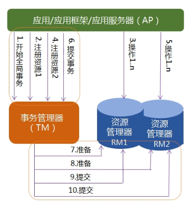

# 标准分布式事务

XA是由X/Open组织提出的分布式事务的规范。XA规范主要定义了（全局）事务管理器（TM）和（局部）资源管理器（RM）之间的接口。主流的关系型数据库产品都实现了XA接口。

XA接口是双向的系统接口，在事务管理器（TM）以及一个或多个资源管理器（RM）之间形成通信桥梁。

XA之所以需要引入事务管理器是因为，在分布式系统中，从理论上讲两台机器无法达成一致的状态，需要引入一个单节点进行协调。

由全局事务管理器，管理和协调的事务，可以跨多个资源（如数据库或者JMS队列）和进程。全局事务管理器一般使用XA进行二阶段提交协议与数据库进行交互。

## 两阶段提交（Two Phase Commit） - 2PC


2PC将事务的提交过程分为：
- 准备阶段
- 提交阶段

事务的发起者（TM集成到业务服务中，称为协调者）称为协调者，事务的执行者（一般指实现了XA协议的数据库等）称为参与者

阶段1：准备阶段
1、协调者向所有参与者发送事务内容，询问是否可以提交事务，并等待所有参与者答复。
2、各参与者执行业务操作，但不提交事务
3、如参与者业务执行成功，给协调者反馈YES，即可以提交；如执行失败，给协调者反馈NO，即不可提交。

阶段2：提交阶段
所有参与者反馈YES，则向所有参与者开始进行事务提交。
任何一个参与者反馈NO时，则终止整个事务内容执行，协调者向所有参与者发出事务回滚指令。

```java
// F:\BaiduYunDownload\架构视频\20191201_分布式事务.mp4  00:34:39

// 引入spring-boot-starter-jta-atomikos包，就支持了分布式事务
```

2PC方案 - 使用简单，但是为什么没人使用呢？
性能太低，性能只有10%（需要确认！！！）


# 柔性事务 - BASE理论
BA: Basic Avalibility 基本业务可用性
S: Sofe state 柔性状态（中间态不一致）
E: Eventual consistency 最终一致性

> 为了更高的性能，高可用，牺牲一致性

> 难点：业界尚未有特别成熟、大规模普及的无侵入性的框架方案

## 三阶段提交协议 - 3PC（对2PC优化）

3PC是对2PC的改进版本。
> 事务的提交过程： CanCommit、PreCommit、doCommit三个阶段来进行处理

阶段1：
1、协调者向参与者发出CanCommit请求，询问是否可以提交事务，并等待所有参与者答复。
2、参与者收到CanCommit其你去后，如果可以执行事务操作，则反馈yes，否则返回no。

阶段2：（资源进行加锁）
1、所有参与者均反馈YES,即执行事务预提交。
2、任何一个参与者反馈no，或者等待超时后协调者尚无法收到所有参与者的反馈，即中断事务。

阶段3：（资源锁释放）
1、所有参与者均反馈Ack响应，即执行真正的事务提交。
2、任何一个参与者反馈No，或者等待超时后协调者尚无法收到所有参与者的反馈，即中断事务。

> 为什么3阶段性能会提交呢？
网络抖动情况，不再等待，直接提交（大量缩短锁的时间）
1. CanCommit  -> no -> 全体回滚
2. PreCommit  -> no ? 'rollback' ? yes
2. doCommit -> 宕机恢复时，直接commit


* lcn -> 3PC方案  seata -> 自己做的流程 *

### lcn的3阶段提交（@LcnTransaction）(只有Dubbo能直接配合吗？)

```java
// lcn的3阶段提交  tx-manager
```

### TCC事务(lcn框架也实现了TCC方案)（@TccTransaction）


* 基本上分布式事务框架都支持TCC *

> lcn框架实现了  3PC、TCC方案


