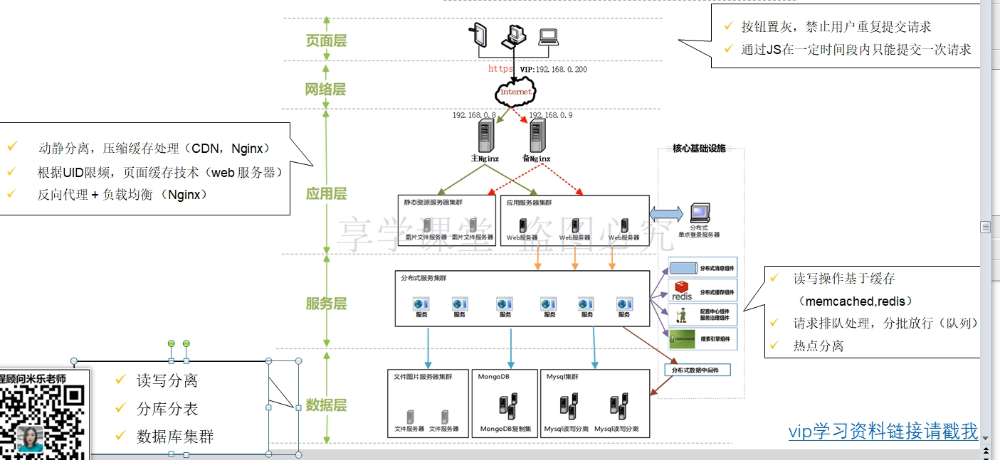

## 方案1： (synchronized)
> CountDownLatch，该方案的性能很低，而且只能支持单击，只能玩玩的方案。

> 基于并发包的原子操作类实现

## 方案2： 实现乐观锁机制（CAS机制）（Compare and Swap）（基于数据库的Version版本来实现的乐观锁）
> 基于Mysql，通过版本号实现

> 步骤分析： 1.读取数据 -> 2.比较版本  -> 3.更新数据

**Java的原子类也实现了CAS，不过CAS是最底层的CPU实现**

**总结数据库乐观锁实现：
优点： 简单高效、稳定可靠
缺点： 并发能力低，性能不高**

## 方案3： 就与Redis/Memecache的CAS来实现的乐观锁，完成秒杀
Memcached的CAS在1.2.4新增的特性，通过gets和cas实现。
Redis利用Watch指令在Redis事务中提供CAS的能力。
> 基于缓存缓存性能提升比较大，但是真正的流程也只能达到百万级别？千万级别的需要其他方案？

## 方案4：基于整个系统架构来解决秒杀方案

