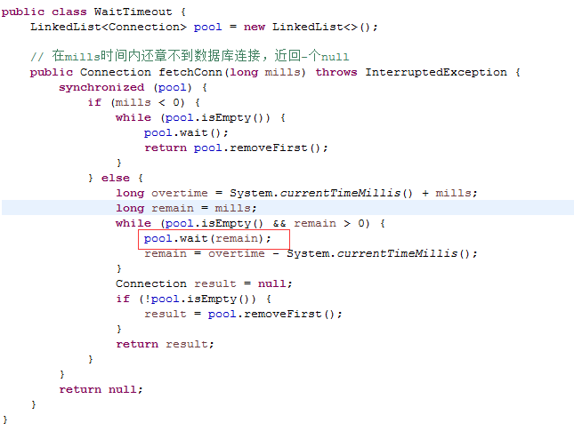

### CPU核心数和线程数的关系
核心数:线程数=1:1; 超线程技术->1:2。

### CPU时间片轮转机制
RR调度，通过时间片轮转，进行上下文切换，一次线程上下文切换需要消耗5000-20000

### 什么是进程和线程
进程: 程序运行资源分配的最小单位，进程内部有多个线程，会共享这个进程的资源
线程: CPU调度的最小单位

### 什么是并行和并发
并行:同一时刻，可以处理事情的能力。
并发:与时间单位相关的，在单位时间内可以处理事情的能力

### 高并发编程的意义、好处和注意事项。
共享资源，存在冲突;死锁;太多的线程，就有搞垮机器


### 有哪些方式让Java里的线程安全停止工作呢？
1、自然执行完
2、抛出异常
2、stop(), resume(),suspend(),线程不会释放资源

### 怎么理解JAVA线程是协作式，而非协作式。
interrupt()中断一个线程。
interrupted()判定当前线程是否处于中断状态
static方法iterrupted()判定当前线程是否处于中断状态
```java
package com.msa.bee.data.test.xue;

public class EndThread {
    private static class UseThread extends Thread {
        public UseThread(String name) {
            super(name);
        }

        @Override
        public void run() {
            String threadName = Thread.currentThread().getName();
            while (!isInterrupted()) {
                System.out.println(threadName + " is run!");
                System.out.println(threadName + " interrput flag is " + isInterrupted());
            }
        }
    }

    public static void main(String[] args) throws InterruptedException {
        Thread endThread = new UseThread("endThread");
        endThread.start();
        Thread.sleep(20);
        System.out.println("准备停下来吧");
        endThread.interrupt();
    }

}
```

如果线程中抛出InterruptedException异常，线程中止位会被复原为false，所以想要线程中断，必须在捕获该异常后，再次发出终止指令。
```java
package com.msa.bee.data.test.xue;

public class HasInterruputException {
    public static class UseThread extends Thread {
        public UseThread(String threadName) {
            setName(threadName);
        }

        @Override
        public void run() {
            String threadName = Thread.currentThread().getName();
            while (!isInterrupted()) {
                try {
                    Thread.sleep(100);
                } catch (InterruptedException e) {
                    System.err.println(threadName + " interrput flag is " + isInterrupted());
                    // 在抛出InterruptedException异常后，线程中止位会被复原为false，所以想要线程中断，必须在捕获该异常后，再次发出终止指令。
                    interrupt();
                }
                System.out.println(threadName + " interrput flag is " + isInterrupted());
            }
        }
    }

    public static void main(String[] args) throws InterruptedException {
        Thread endThread = new UseThread("HasInterrputEx");
        endThread.start();
        Thread.sleep(500);
        endThread.interrupt();
    }

}
```

守护线程，会在主线程结束时一并结束，不保证守护线程中的逻辑完整执行，守护线程直接退出。

### volatile关键字有什么用？
volatile 仅在一个线程写，其他线程读才有用。


### synchronized锁定类、锁定对象
```java
public class SyncClzAndObject {
    // 普通方法的锁是对实例的锁
    public synchronized void instance2() throws InterruptedException {
        Thread.sleep(3000);
        System.out.println("synInstance2 is going.. ." + this.toString());
        Thread.sleep(3000);
        System.out.println("synInstance2 ended " + this.toString());
    }

    // 静态方法是对class的锁定
    public static synchronized void synClass() throws InterruptedException {
        Thread.sleep(1000);
        System.out.println("synClass going...");
        Thread.sleep(1000);
        System.out.println("synClass end");
    }
}
```


第三个视频

00:41:47  wait/notify/notifyAll 概念

```java
public class Express {
    private int km;
    private String site;

    public Express(int km, String site) {
        super();
        this.km = km;
        this.site = site;
    }

    /* 变化公里数，然后通知处于wait状态并需要处理公里数的线程进行业务处理 */
    public synchronized void changeKm() {
        this.km = 101;
        notifyAll();
    }

    /* 变化地点，然后通知处于wait状态并需要处理地点的线程进行业务处理 */
    public synchronized void changeSite() {
        this.site = "BeiJing";
        notifyAll();
    }

    public synchronized void waitKm() {
        while (this.km <= 100) {
            try {
                wait();
                System.out.println("check km thread[" + Thread.currentThread().getId() + "] is be notifed.");
            } catch (InterruptedException e) {
                System.out.println("the km is" + this.km + ",I will change db.");
            }
        }
    }

    public synchronized void waitSite() {
        while (!this.site.equals("BeiJing")) {
            try {
                wait();
                System.out.println("check site thread[" + Thread.currentThread().getId() + "] is be notifed.");
            } catch (InterruptedException e) {
                System.out.println("the site is" + this.site + ",I will change db.");
            }
        }
    }
}
```

notifyAll会唤醒锁定该对象的所有线程，而notify只会唤醒一个线程


wait等待超时

wait方法可以设置

### join()方法
线程A,执行了线程B的join方法，线程A必须要等待B执行完成了以后，线程A才能继续自己的工作
```java
public class UseJoin {
    static class JumpQueue implements Runnable {
        private Thread thread;

        public JumpQueue(Thread thread) {
            this.thread = thread;
        }

        public void run() {
            try {
                thread.join();
            } catch (InterruptedException e) {
                e.printStackTrace();
            }
            System.out.println(Thread.currentThread().getName() + " terminted.");
        }
    }

    public static void main(String[] args) throws Exception {
        Thread previous = Thread.currentThread();
        for (int i = 0; i < 10; i++) {
            Thread thread = new Thread(new JumpQueue(previous), String.valueOf(i));
            thread.start();
            previous = thread;
        }
        SleepTools.second(2); // 让主线程休眠2秒
        System.out.println(Thread.currentThread().getName() + " terminate.");
    }
}
```
运行结果：
```sh
main terminate.
0 terminted.
1 terminted.
2 terminted.
3 terminted.
4 terminted.
5 terminted.
6 terminted.
7 terminted.
8 terminted.
9 terminted.
```
说明：每一个创建的线程都会join到前一个线程之后，所以必须等最开始的那个线程执行完后，才会让下一个线程继续执行。


调用yield/sleep/wait/notify等方法对锁有什么影响？
yield() sleep() 不释放锁
wait() 调用之前必须持有锁，调用wait的时候锁会释放，当wait方法返回时申请拿锁。
notify() 调用之前必须持有锁，调用notify()方法本身不会释放锁的。


2、线程的并发工具类
Fork-Join
```java
public class SumArray {
    private static class SumTask extends RecursiveTask<Integer> {
        private static final long serialVersionUID = 1L;
        private final static int THRESHOLD = MakeArray.ARRAY_LENGTH / 10;
        private int[] src; // 表示我们要实际统计的数组
        private int fromIndex; // 开始统计的下标
        private int toIndex; // 统计到哪里结束的下标

        public SumTask(int[] src, int fromIndex, int toIndex) {
            this.src = src;
            this.fromIndex = fromIndex;
            this.toIndex = toIndex;
        }

        @Override
        protected Integer compute() {
            if (toIndex - fromIndex < THRESHOLD) {
                int count = 0;
                for (int i = fromIndex; i <= toIndex; i++) {
                    SleepTools.ms(1);
                    count = count + src[i];
                }
                return count;
            } else {
                // fromIndex. .. .mid... . toIndex
                int mid = (fromIndex + toIndex) / 2;
                SumTask left = new SumTask(src, fromIndex, mid);
                SumTask right = new SumTask(src, mid + 1, toIndex);
                invokeAll(left, right);
                return left.join() + right.join();
            }
        }
    }

    public static void main(String[] args) {
        ForkJoinPool pool = new ForkJoinPool();
        int[] src = MakeArray.makeArray();
        SumTask innerFind = new SumTask(src, 0, src.length - 1);
        long start = System.currentTimeMillis();
        pool.invoke(innerFind);
        System.out.println("Task is Running.....");
        System.out.println("The count is " + innerFind.join() + " spend time: " + (System.currentTimeMillis() - start) + "ms");
    }
}
```

CountDownLatch.
作用:是一组线程等待其他的线程完成工作以后在执行，加强版join,
await用来等待，countDown 负责计数器的减一。
CyclicBarrier.
让一组线程达到某个屏障，被阻塞，- -直到组内最后-一个线程达到屏障时，屏障开放,所
有被阻塞的线程会继续运行Cclicarrerint parties)u
CclcBarrierlint parties, Runnable barrierAction), 屏障开放，barrierAction 定义的任务会执
行。
CountDownlatch和CyclicBarrier辨析。


信号量Semaphore概念


Exchange，两个线程数据交换


00:12:00 Callable/Future和FutureTask 概念
00:22:00 Callable/Future和FutureTask 代码演示


第七个视频
01:02:00 AtomicStampedReference 代码演示

什么是公平锁   什么是非公平锁
### 显式锁和AQS
显式锁
Lock接口和核心方法
### Lock接口和synchronized的比较
synchronized代码简洁，Lock: 获取锁可以被中断，超时获取锁，尝试获取锁.
可重入锁Reentrantlock.所谓锁的公平和非公平。
如果在时间上，先对锁进行获取的请求，一定先被满足，这个锁就是公平的，不满足，就是
非公平的。
非公平的效率一般来讲更高.


第八个视频
00:19:00 可重入锁 代码演示  (Lock和Condition配合使用)


第九个视频
01:11:00 基于AQS实现独占锁


AQS非常重要

