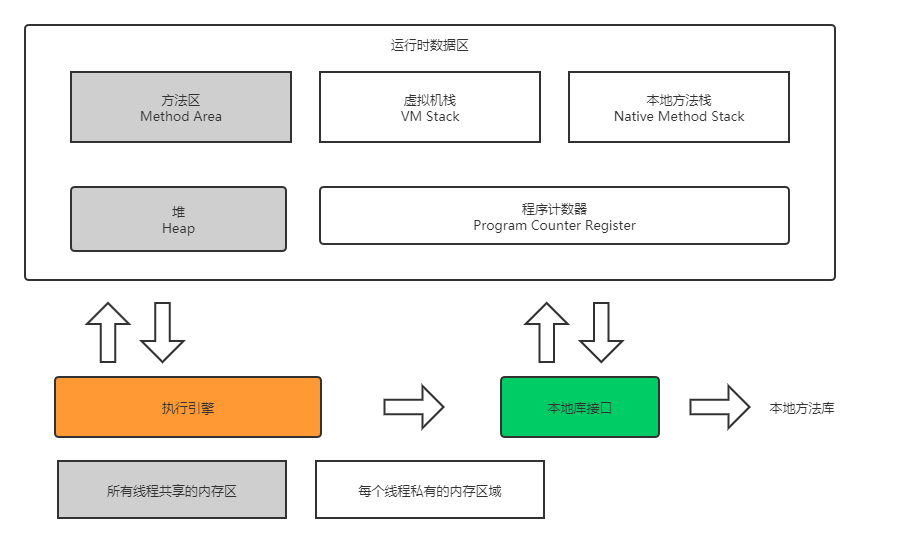
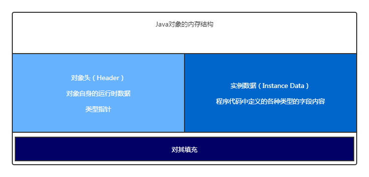
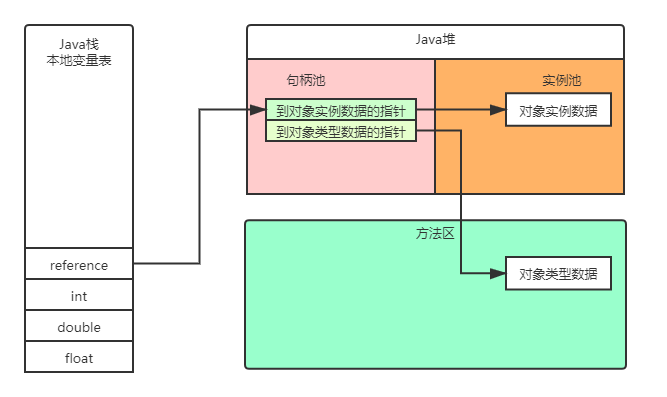

### 1、JVM的发展历史  
- Sun发布的使用最广泛的JVM叫HotSpot VM，名称`热点`来源与JVM的JIT技术，对一些热点代码进行编译执行。  
将热点代码通过JIT技术即时编译成`机器码`，或称之为`本地代码`，从而实现热点代码高性能执行。

- BEA JRockit 虚拟机，最初由 `Appeal Virtual Machines` 开发，02年被`BEA Systems`收购，07年`BEA Systems`又被`Oracle`收购.  

- Sun公司被Oracle收购，`HotSpot VM`与`JRockit`合并，并且定期会将功能同步到`Open JDK`  

### JVM运行时数据区分配
  
定义：Java虚拟机在执行Java程序的过程中会吧他所管理的内存区划分为若干个不同的数据区域。  
类型：方法区（运行时常量池）、堆 是所有线程公共使用的内存区；而本地方法栈、虚拟机栈、程序计数器是每个线程独立拥有，生命周期与线程一致； 直接内存  


程序计数器： 较小的内存空间，当前线程执行的字节码的行号指示器；各线程之间独立存储，互不影响  

Java栈：线程私有，生命周期和线程一致，每个方法在执行的同时会创建一个栈帧用于存储局部变量表、操作数栈、动态链接、方法出口等信息。
方法的执行就对应着栈帧在虚拟机栈中入栈、出栈的过程；栈里面存放着各种基本数据类型和对象的引用。
通过虚拟机参数` -Xss `调整每个线程分配的栈内存大小。  

本地方法栈：本地方法栈保存的是Native方法信息，当一个JVM创建的线程调用Native方法时，栈帧不会创建到`虚拟机栈`中，JVM只是简单的动态链接并直接调用Native方法。  

堆： Java堆是Javaer需要重点关注的一块区域，因为涉及到内存分配（new 关键字，反射等）与回收（回收算法，收集器等）  
常用的虚拟机参数：  
`-Xms`
`-Xmx`
`-XX:NewSize`
`-XX:MaxNewSize`
`-Xmn`

方法区： 也叫永久区，用于村粗已经被虚拟机加载的类信息、常量（"abc", "123"等），静态变量（static变量）等数据。  
常用的虚拟机参数： 
`-XX:PermSize`  `-XX:MaxPermSize`  
`-XX:MetaspaceSize`  `-XX:MaxMetaspaceSize`  

运行时常量池： 运行时常量池是方法区的一部分，用于存放编译期生成的各种字面量（"abc", "123"等）和符号引用。  

> 虚拟机栈、本地方法栈、程序计数器 为线程是有的，生命周期与线程生命周期一致，所以无需考虑垃圾回收。
> 所需的内存大小，在编译时就确定了。

##### JDK1.6 JDK1.7 JDK1.8 3个版本的虚拟机内存分配差异
   
JDK1.6 时，`运行时常量池`放在`方法区`中

   
JDK1.7 时，`运行时常量区` 移出了方法区，放到`堆`中了

   
JDK1.8 时，方法区从JVM内存中移除，在本机内存中创建了一个`元数据空间`  
永久代用于存储类信息、常量、静态变量等数据不是好办法，很容易导致内存溢出的问题。  
对永久代进行调优是很困难的(why?)，同时将元空间与对的垃圾回收进行隔离，避免永久代引发的Full GC和OOM等问题。  

> 什么将元空间放到了虚拟机内存之外？ 为什么永久代不好调优？ !!!!!!!!!!!!!!!

### 直接内存

不是JVM运行时数据区的一部分，也不是JVM虚拟机规范中定义的内存区：  

- 如果使用了NIO，这块区域会被频繁使用，在Java堆内可以使用DirectByteBuffer对象直接饮用并操作；
  
- 这块内存不收JVM堆大小限制，但受本机总内存的限制，可以通过`MaxDirectMemorySize`JVM参数来设置（默认与堆内存最大值一样），所以也会出现OOM异常。  

JVM内存区分为： 堆、栈  
JVM使用的非对内存区： 栈、本地内存中的直接内存  


### 深入辨析堆和栈

**功能**
- 以栈帧的方式的存储方法调用的过程，并存储方法调用过程中基本的基本数据类型的变量（int/short/long/byte/float/double/boolean/char等）以及对象的引用变量，
其内存分配在栈上，变量除了作用域就会自动释放；

- 而堆内存用来存储Java中的对象。无论是成员变量，局部变量，还是类常量，他们执行的对象都存储在堆内存中。

**线程独享还是共享**
- 栈内存归属于单个线程，每个线程都会有一个栈内存，其存储的变量只能在其所属线程中可见，所以内存可以理解成线程的私有内存。

- 堆内存中的对象对所有线程可见。堆内存中的对象可以被所有线程访问。

**空间大小**
- 栈的内存要远远小于对内存，栈的深度是有限制的，可能会发生StackOverFlowError错误。

### 方法的出入栈，以及对象栈上分配
  

> 每一次方法调用，都会讲方法打包成一个栈帧，然后将栈帧压入`栈`中。或者可以说方法的调用过程就是栈帧入栈出栈的过程。
> 每一个栈帧包含：局部变量表、操作数栈、帧数据区；

**栈上分配**
指进行逃逸分析时，确定对象进在方法作用域内有效时，可以进行栈上分配，即对象直接存储在栈内存中。该对象的生命周期在该方法返回时回收。  
所以栈上分配，对象跟着函数的调用自行销毁，提高了虚拟机的性能，减小了GC压力。  
逃逸分析默认是开启状态！！！

```java
package com.liyong.trans.jvm;

public class StackAlloc {
    public static class User {
        public int id = 0;
        public String name = "";
    }

    public static void alloc() {
        User user = new User();
        user.id = 10;
        user.name = "Hello World";
    }

    public static void main(String[] args) {
        long start = System.currentTimeMillis();
        // 循环一亿次
        for (int i = 0; i < 1_0000_0000; i++) {
            alloc();
        }
        long end = System.currentTimeMillis();
        System.out.println("times: " + (end - start) + " ms");
    }
}
```

1、启动时的虚拟机参数
```shell script
-server
-Xmx10m
-Xms10m
-XX:+DoEscapeAnalysis
-XX:+PrintGC
-XX:+EliminateAllocations
-XX:-UseTLAB
```
执行效果
```shell script
[GC (Allocation Failure)  2047K->592K(9728K), 0.0021114 secs]
times: 8 ms
```

2、启动时的虚拟机参数
```shell script
-server
-Xmx10m
-Xms10m
-XX:+DoEscapeAnalysis
-XX:+PrintGC
-XX:-EliminateAllocations
-XX:-UseTLAB
```
> 此处将EliminateAllocations标量替换关闭了，及不进行栈上分配

执行效果
```shell script
[GC (Allocation Failure)  2047K->632K(9728K), 0.0034478 secs]
[GC (Allocation Failure)  2680K->624K(9728K), 0.0016135 secs]
[GC (Allocation Failure)  2672K->632K(9728K), 0.0052727 secs]
.
.
.
.
.
[GC (Allocation Failure)  2682K->634K(9728K), 0.0002961 secs]
[GC (Allocation Failure)  2682K->634K(9728K), 0.0005318 secs]
times: 3021 ms
```
> 执行了N次垃圾回收，总共耗时3021ms

3、启动时采用默认配置
执行效果
```shell script
times: 21 ms
```
> !!!!!!!!!!!这里需要再次捋下怎么查看虚拟机的默认配置值！！！！！！！！ 

参数详情： 
> `-server` 启用服务器模式  
  `-Xmx10m` 设置堆最大内存  
  `-Xms10m` 设置堆最小每次  
  `-XX:+DoEscapeAnalysis` 启用逃逸分析  
  `-XX:+PrintGC` 打印GC日志  
  `-XX:+EliminateAllocations` 标量替换，栈上分配  
  `-XX:-UseTLAB` 启用为线程分配私有内存  
> ThreadLocalAllocBuffer(TLAB)，事先在堆里面为每个线程分配一块私有内存，避免多线程内存分配时竞争激烈。  
> 在配置虚拟机参数是 `-XX:+` 标识启用特定功能 `-XX:-` 表示关闭特定功能  
> `-XX:+DoEscapeAnalysis` `-XX:+EliminateAllocations` 必须同时开启才能启用栈上分配。  

### 什么是逃逸分析？


### 虚拟机中对象的创建过程

`1、检查加载`  -->  `2、分配内存`  -->  `3、内存空间初始化`  -->  `4、设置`  -->  `5、对象初始化`

- 内存分配：划分内存时通过两种方式：指针碰撞和空闲列表。划分内存时也会存在并发安全问题，通过使用CAS配上失败重试和本地线程分配缓冲区来解决

> 对象的创建过程需要再单独梳理；指针碰撞、空间列表分别的使用场景需要再仔细分析下；CAS、线程分配缓冲区之间的关联是什么。

### Java对象的结构，一个Java对象都由哪些部分组成
  

> Java对象的接口是什么？

### 对象的访问定位
  
  

Hotspot VM 使用的是直接指针的方式进行对象定位


### 堆溢出代码演示
Java代码
```java
package com.example.demo.gc;

import java.util.LinkedList;
import java.util.List;

public class HeapOOM {
	public static void main(String[] args) {
		List<Object> list = new LinkedList<>();
		while (true) {
			list.add(new Object());
		}
	}
}
```
虚拟机参数：
```shell script
-Xms5m
-Xmx5m
-XX:+PrintGC
```

控制台输出参数：
```shell script
[GC (Allocation Failure)  1024K->768K(5632K), 0.0050360 secs]
[GC (Allocation Failure)  1792K->1808K(5632K), 0.0039762 secs]
[GC (Allocation Failure)  3872K->3888K(5632K), 0.0037171 secs]
[Full GC (Ergonomics)  4823K->4823K(5632K), 0.0156368 secs]
[Full GC (Ergonomics)  4948K->4948K(5632K), 0.0178596 secs]
[Full GC (Ergonomics)  5053K->5053K(5632K), 0.0206748 secs]
[Full GC (Ergonomics)  5054K->5054K(5632K), 0.0214069 secs]
Exception in thread "main" [Full GC (Ergonomics) java.lang.OutOfMemoryError: GC overhead limit exceeded
 5058K->607K(5632K), 0.0188681 secs]
	at com.example.demo.gc.HeapOOM.main(HeapOOM.java:10)
```

> 进行多次GC后，抛出了java.lang.OutOfMemoryError: GC overhead limit exceeded

Java代码
```java
package com.example.demo.gc;

import java.util.LinkedList;
import java.util.List;

public class HeapOOM {
	public static void main(String[] args) {
		List<Object> list = new LinkedList<>();
		while (true) {
			list.add(new char[512]);
		}
	}
}
```
虚拟机参数：
```shell script
-Xms5m
-Xmx5m
-XX:+PrintGC
```

控制台输出参数：
```shell script
[GC (Allocation Failure)  1024K->768K(5632K), 0.0148354 secs]
[GC (Allocation Failure)  3989K->4085K(5632K), 0.0135805 secs]
[Full GC (Ergonomics)  4085K->3744K(5632K), 0.0205979 secs]
[Full GC (Allocation Failure)  5119K->5119K(5632K), 0.0173234 secs]
[Full GC (Ergonomics)  5119K->606K(5632K), 0.0059115 secs]
Exception in thread "main" java.lang.OutOfMemoryError: Java heap space
	at com.example.demo.gc.HeapOOM.main(HeapOOM.java:10)
```

> 抛出了java.lang.OutOfMemoryError: Java heap space异常

> 总结：  
> java.lang.OutOfMemoryError: GC overhead limit exceeded 因为一些原因不停的为对象分配空间，分配地太多，把堆内存撑爆了  
> java.lang.OutOfMemoryError: Java heap space 因为分配时，有巨型对象分配空间，内存撑爆了。

### 元数据空间溢出
Java代码
```java
package com.example.demo.gc;

import java.util.LinkedList;
import java.util.List;

public class Metaspace {
	public static void main(String[] args) {
		List<Object> list = new LinkedList<>();
		while (true) {
			list.add(new Object());
		}
	}
}
```
虚拟机参数
```shell script
-XX:MaxMetaspaceSize=2M # 设置元数据空间最大为2M
```
控制台输出
```shell script
Error occurred during initialization of VM
OutOfMemoryError: Metaspace
```
> 直接导致了元数据空间溢出


### Java栈溢出
Java代码
```java
package com.example.demo.gc;

public class StackOOM {
	
	private int stackLength = 0;
	
	private void callback() {
		stackLength++;
		callback();
	}
	
	public static void main(String[] args) {
		StackOOM oom = new StackOOM();
		try {
			oom.callback();
		} catch (Throwable e) {
			e.printStackTrace();
			System.err.println("stackLength: " + oom.stackLength);
		}
	}
}
```
虚拟机参数：
```shell script
-Xss256k # 配置虚拟机栈空间内存带下，默认是1M
```

```shell script
java.lang.StackOverflowError
	at com.example.demo.gc.StackOOM.callback(StackOOM.java:8)
	at com.example.demo.gc.StackOOM.callback(StackOOM.java:9)
	at com.example.demo.gc.StackOOM.callback(StackOOM.java:9)
             .
             .
             .
	at com.example.demo.gc.StackOOM.callback(StackOOM.java:9)
	at com.example.demo.gc.StackOOM.callback(StackOOM.java:9)
stackLength: 2470
```

> java.lang.StackOverflowError 栈内存溢出错误，出现该问题，要考虑是不是出现了无线递归

>  !!!!!! 树的查找，递归、非递归怎么实现？

### 直接内存溢出

Java代码
```java
package com.example.demo.gc;

import java.nio.ByteBuffer;

public class DirectMemory {
	public static void main(String[] args) {
		ByteBuffer buffer = ByteBuffer.allocateDirect(1024 * 1024 * 11);
		System.out.println(buffer);
	}
}
```
虚拟机参数
```shell script
-XX:MaxDirectMemorySize=10M
```

控制台输出：
```shell script
Exception in thread "main" java.lang.OutOfMemoryError: Direct buffer memory
	at java.nio.Bits.reserveMemory(Bits.java:693)
	at java.nio.DirectByteBuffer.<init>(DirectByteBuffer.java:123)
	at java.nio.ByteBuffer.allocateDirect(ByteBuffer.java:311)
	at com.example.demo.gc.DirectMemory.main(DirectMemory.java:7)
```

> 虚拟机参数中，我们限制了直接内存最大为10M，而我们程序中通过NIO的API分配了11M的直接内存，所以直接就直接内存溢出了


