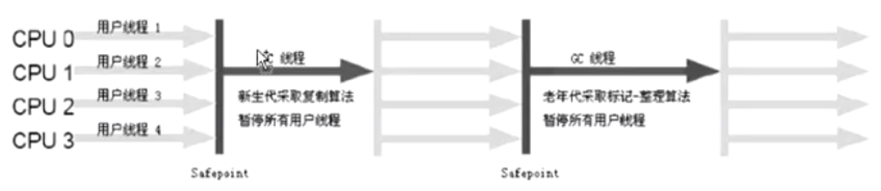
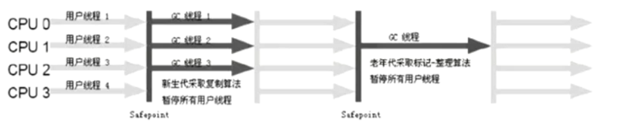
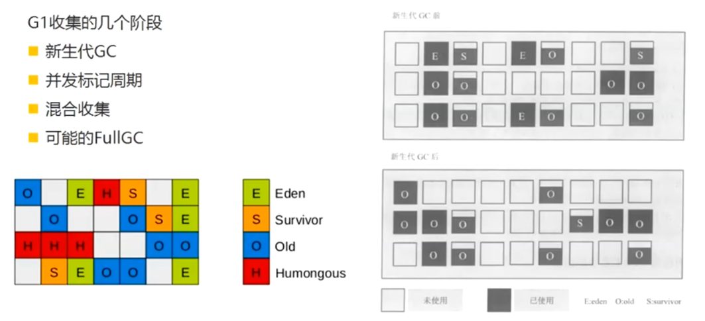

### GC垃圾回收前需要判断对象是否存活
- 引用计数算法
- 可达性分析算法(Hotspot VM采用该种算法)

下图为可达性分析算法的图解：
 

在Java中，哪些可以作为GC Roots的对象：

- 方法区：类静态属性应用的对象
- 方法区：常量引用的对象
- 虚拟机栈(本地变量表)中引用的对象
- 本地方法栈：JNI(Native方法)中引用的对象

 
### Java的引用分类

- 强引用：   
  Object obj = new Object(); 我们使用的引用基本上都是强引用
- 软引用：SoftReference    
  一些有用，但是并非必需，用软引用关联的对象，系统将要发生 `OOM` 前，这些对象就会被回收。
- 弱引用：WeakReference  
  一些有用，但是并非必须，用弱引用关联的对象，只能存活到下次垃圾回收之前，GC发生时，不管内存够不够，都会被回收  
- 虚引用：PhantomReference  
  幽灵引用，最弱，被垃圾回收的时候收到一个通知  

软引用代码实例

```java
package com.liyong.gc;

import java.lang.ref.SoftReference;
import java.util.ArrayList;
import java.util.List;

public class TestSoftReference {
	private static class User {
		private Long userId;
		private String name;
		public User(Long userId, String name) {
			super();
			this.userId = userId;
			this.name = name;
		}
	}
	
	public static void main(String[] args) {
		User user = new User(1000L, "Hello");
		// 将user对象进行软引用
		SoftReference<User> userSoft = new SoftReference<>(user);
		// 取消对user对象的引用
		user = null;
		System.out.println(userSoft.get());
		// 手动发起GC调度请求
		System.gc();
		System.out.println(userSoft.get());
		
		List<Object> list = new ArrayList<>();
		try {
			for (int i = 0; i < 10; i++) {
				System.out.println("foreach start -------: " + userSoft.get());
				// 每次放1M大小的字节到List中
				list.add(new byte[1024*1024*1]);
			}
		} catch (Throwable e) {
			e.printStackTrace();
			System.out.println("Error -------: " + userSoft.get());
		}
		
	}
}
```

JVM虚拟机参数
```shell script
-Xms5m 
-Xmx5m 
-XX:+PrintGC
```

控制台输出  
```shell script
com.liyong.gc.TestSoftReference$User@15db9742
[GC (System.gc())  820K->652K(5632K), 0.0759582 secs]
[Full GC (System.gc())  652K->550K(5632K), 0.0056969 secs]
com.liyong.gc.TestSoftReference$User@15db9742
foreach start -------: com.liyong.gc.TestSoftReference$User@15db9742
foreach start -------: com.liyong.gc.TestSoftReference$User@15db9742
foreach start -------: com.liyong.gc.TestSoftReference$User@15db9742
foreach start -------: com.liyong.gc.TestSoftReference$User@15db9742
[GC (Allocation Failure)  3661K->3782K(5632K), 0.0011918 secs]
[GC (Allocation Failure)  3782K->3718K(5632K), 0.0003072 secs]
[Full GC (Allocation Failure)  3718K->3622K(5632K), 0.0048211 secs]
[GC (Allocation Failure)  3622K->3622K(5632K), 0.0005990 secs]
[Full GC (Allocation Failure)  3622K->3600K(5632K), 0.0043405 secs]
Error -------: null
java.lang.OutOfMemoryError: Java heap space
	at com.liyong.gc.TestSoftReference.main(TestSoftReference.java:34)
```

> 手动调用了`System.gc()`后，进行了一个Full GC，再打印软引用时，引用依旧存在；
> For循环期间每次都在，当抛出OOM错误时，在catch中软引用已经为空。

弱引用  
Java代码：
```java
package com.liyong.gc;

import java.lang.ref.WeakReference;

public class TestWeakReference {
	private static class User {
		private Long userId;
		private String name;
		public User(Long userId, String name) {
			super();
			this.userId = userId;
			this.name = name;
		}
	}
	
	public static void main(String[] args) {
		User user = new User(1000L, "Hello");
		// 将user对象进行软引用
		WeakReference<User> userSoft = new WeakReference<>(user);
		// 取消对user对象的引用
		user = null;
		System.out.println(userSoft.get());
		// 手动发起GC调度请求
		System.gc();
		System.out.println(userSoft.get());
	}
}
```

输出结果  
```shell script
com.liyong.gc.TestWeakReference$User@15db9742
[GC (System.gc())  821K->684K(5632K), 0.0104242 secs]
[Full GC (System.gc())  684K->550K(5632K), 0.0155235 secs]
null
```

> 通过输出可见，在进行GC之后，弱引用就回收了

### 垃圾回收算法
标记-清除算法(Mark-Sweep)
.png) 

复制算法(Copying)
.png) 

> `标记-清除`算法会产生空间碎片，但是回收速度较快；
> `复制`算法，不会产生空间碎片，内存很整齐，但是会浪费一般空间，用于复制 

`Hotspot VM`则是使用了这两种算法

分代收集：  
 

新生代、老年代的收集器是配合使用的。  
图中的连线，代表新生代、老年代使用垃圾回收器的对应关系，新生代、老年代的垃圾回收器不是任意组合的。

> 1、老年代想使用 `CMS` 那么新生代只能使用 `Serial` `PerNew`。
> 因为CMS是标记清除算法，会发生很多空间碎片，所以经过多次GC后，因为部分空间不连续，无法被再次分配到。
> 所以当内存达到一定阀值后，`Serial Old` 会被启用，从而进行Full GC，这个时候会`Stop The World`。  
>
> 2、老年代想使用`Parallel Old`时，新生代只能使用`Parallel Scavenge`。
> 当然`Parallel Scavenge`和`Parallel Old`是JDK8的默认垃圾收集器。  
>
> 3、新生代中复制算法；而老年代CMS使用的标记清除算法； Serial Old(MSC)使用的是复制整理算法； 
> TODO 针对不同的垃圾回收机制整理实现算法
>
> 3、`G1`垃圾收集器收集所有堆空间。

根据统计，90%的对象都是朝生夕死，所以只有10%左右的对象才不会被回收。
所以在新生代中使用`标记-复制`算法的时候，并不是将所有内存一分为二的。

新生代分： Eden / Survivor  有两个Survivor   

默认空间分配比例是   8:1:1  Eden : Survivor From : Survivor To  

回收过程是： Eden From  中的存活对象 复制到 To 中，回收完后， From To 区域的标识互换，即 原来的To变成了From，而原来的From变成了To

新生代的GC叫 Minor GC； 老年代GC叫Full GC

### JDK的垃圾收集器

| 收集器	| 收集对象和算法	| 收集器类型	| 说明	| 适用场景 |
| ----  |  ----         |   ----    | ----  | ----    | 
| Serial |	新生代，复制算法 |	单线程	| |	"简单高效<br>适合内存不大的情况" |
| ParNew	| 新生代，复制算法	| 并行的多线程收集器	| ParNew垃圾收集器是Serial收集器的多线程版本	| 配合CMS垃圾收集器的首选| 
| Parallel Scavenge	| 新生代，复制算法	| 并行的多线程收集器	| 类似ParNew，更加关注吞吐量。<br>达到一个可控的吞吐量<br>是Server级别多CPU机器上的默认GC方式<br>主要适合后台运算，不需要太多交互的任务| 
| Serial Old	| 老年代，标记整理算法	| 单线程		| Client模式下虚拟机使用| 
| Parallel Old	| 老年代，标记整理算法	| 并行的多线程收集器	| Parallel Scavenge收集器的老年代版本，为了配合Parallel Scavenge的面向吞吐量的特性而开发的对应组合	在注重吞吐量以及CPU密集型的场合使用| 
| CMS	| 老年代，标记清除算法	| 并发与并行收集器	| "尽可能的缩短垃圾收集时用户线程停止时间；缺点在于：<br>1、存在内存碎片<br>2、需要更多的CPU资源<br>3、浮动垃圾问题，需要更大的空间"	| 重视服务的响应速度、<br>系统停顿时间和用户体验的互联网网站或者B/S系统。<br>互联网后端目前CMS是主流的垃圾收集器| 
| G1	| 跨新生代和老年代；<br>标记整理+化整为零| 并发与并行收集器| JDK1.7才正式引入，采用分区回收的思维，<br>基本不牺牲吞吐量的前提下完成低停顿的内存回收；<br>可预测的停顿是其最大的优势。	| 面向服务端应用的垃圾收集器，目标为取代CMS| 

 

> 吞吐量 = 运行用户代码时间 / (运行用户代码时间 + 垃圾收集时间)  
> 垃圾收集时间 = 垃圾回收率 * 单词垃圾回收时间  
> 并行： 垃圾收集的多相处同时回收    
> 并发： 垃圾收集器的多线程和应用的多线程同时进行  

查看机器的JVM垃圾回收机制：  

```shell script
E:\>java -XX:+PrintCommandLineFlags -version
-XX:InitialHeapSize=266915840 -XX:MaxHeapSize=4270653440 -XX:+PrintCommandLineFlags -XX:+UseComprividualAllocation -XX:+UseParallelGC
java version "1.8.0_05"
Java(TM) SE Runtime Environment (build 1.8.0_05-b13)
Java HotSpot(TM) 64-Bit Server VM (build 25.5-b02, mixed mode)

E:\>
```

> 从结果 `-XX:+UseParallelGC` 可得出我当前PC机器的垃圾收集器是 `Parallel Scavenge` 和 `Parallel Old`

### 垃圾回收器工作示意图

- Serial / Serial Old收集器运行示意图
 

- ParNew / Serial Old收集器运行示意图
 

- Parallel Scavenge / Parallel Old收集器运行示意图


- Concurrent Mark Sweep收集器运行示意图
 

`Serial`  `Serial Old` 最古老的，单线程，独占式，成熟、单核CPU  
> -XX:+UseSerialGC 新生代 `Serial`  老年代 `Serial Old`    
> -XX:+UseParNewGC 新生代 `ParNew`  老年代 `Serial Old`  
> -XX:+UseParallelGC 新生代 `Parallel GC`  老年代 `Serial Old`  
> -XX:+UseParallelOldGC 新生代 `Parallel GC` 老年代 `Parallel Old`
> -XX:+UseConcMarkSweepGC 新生代 `ParNew` 老年代 `CMS`

`ParNew` 和 `Serial` 处理方式基本没区别，区别在于：多线程，多CPU的使用，停顿时间比Serial短  

```shell script
-XX:MaxGCPauseMills # 控制最大停顿时间
-XX:GCTimeRatio # 允许垃圾回收时间的比例 吞吐量的倒数 整数 = 19 那么允许的时间是 1 / (1 + 19) = 5%  
-XX:+UseAdaptiveSizePolicy  # 每次GC后悔重新计算Eden From To的大小，计算依据是GC过程中的GC时间、吞吐量、内存占用量
-XX:+UseParallelOldGC  # 新生代 `Parallel GC` 老年代 `Parallel Old`
```

JDK1.8默认使用 `-XX:+UseParallelGC` 垃圾收集器，该垃圾收集器默认启动了`-XX:+UseAdaptiveSizePolicy`  

> CMS 在互联网或者B/S系统的服务端，这类应用注重服务的响应速度，系统系统的停顿时间最短，以给用户代理较好的体验。所以CMS是该业务场景的最佳实践。  
> CMS (Concurrent Mark Sweep) 并发标记清除算法，他的运行过程比其他几种垃圾收集器复杂些，整个过程分4部：  
> - 初始标记 - 短暂，仅仅只是标记一下`GC Roots`能直接关联到的对象，速度很快  
> - 并发标记 - 和用户的应用程序同时进行，进行`GC Roots Tracing`的过程  
> - 重新标记 - 短暂，修正并发标记期间因用户程序继续运行而导致标记产生变动的那一部分对象重新标记，
>   这个阶段的停顿时间一般会`初始标记`的时间长，但是远比`并发标记`耗时短  
> - 并发清除 - 整个过程中耗时最长的`并发标记`和`并发清除`过程收集器线程都可以与用户线程一起工作，所以从总体上来讲，CMS收集的内存回收过程是与用户线程一起并发执行的。
>   `-XX:+UseConcMarkSweepGC`表示新生代使用ParNew，老年代使用CMS  
> 
> CMS的缺点就是会产生浮动垃圾，每次GC后，都还存在部分垃圾对象未被回收的情况。


`并发清除`过程中，用户线程继续运行，所以需要在GC时给用户线程预留足够的娙内存空间。
参数： `-XX:CMSInitialOccupyFraction` 当老年代空间使用超过这个值时启动收集 （68% ~ 92%）。
出现错误 `Concurrent Mode Failure` 系统会启动Serial Old收集。  
`-XX:UseCMSCompactAtFullCollection` （默认开启） 需要进行Full GC的时候开启内存碎片整理，无法并发。  
`-XX:CMSFullGCsBeforeCompaction` （默认0） 设置多少次不压缩的FullGC后再来一次压缩的。

  
### G1 垃圾回收器
 

G1是混合收集，新老同时收集，内存结构不像其他收集器一样划分成连续的Eden From To Old区  

 

> `-XX:+UseG1GC`  
> 特点： 并行和并发，分代收集，空间整合，整体上看是标记-整理算法，局部看是复制算法，没有空间碎片，可预测的停顿。  
>
> 初始标记 - 短暂，仅标记GC Roots能直接关联到的对象，速度快，产生一个全局停顿，都会有一次新生代GC  
>
> 根区域扫描： 扫描Survivor区可以直接到达老年代区域  
>
> `-XX:MaxGCPauseMillis` 指定目标的最大停顿时间，G1尝试调整新生代和老年代的比例，堆大小，晋升年龄  
>
> `-XX:ParallelGCThreads` GC的工作线程数量

### ZGC 垃圾收集器  

JDK11中的ZGC是一种可延展的低延迟的垃圾收集器  
- 处理TB量级的堆
- GC时间不超过10ms
- 与使用G1相比，应用吞吐量的降低不超过15%

ZGC通过技术手段把Stop The World的情况控制在仅一次，就是第一次的初始化标记才会发生，这样就不难理解为什么GC停顿时间不随着堆增大而上升了，再大的内存也能通过并发的时间去回收。  
关键技术：  
1、有色指针(Colored Pointers)  
2、加载屏障(Load Barrier)  


### Stop The World代码实例演示
Java代码

```java
package com.example.demo.gc;

import java.util.LinkedList;
import java.util.List;

/**
 * 生成大量的放到老年代，并且移除引用，使其在老年代中形成大量的垃圾对象<br>
 * 一个线程一定时间间隔打印一次，通过每次打印时间间隔是否一致，来判断是否发生Stop The World
 * @author Administrator
 */
public class StopTheWorld {
	private static class PushDataThread extends Thread {
		List<byte[]> list = new LinkedList<>();
		@Override
		public void run() {
			while(true) {
				if(list.size() % (1024 * 1024) == 0) {
					list.clear();
					System.out.println("list clear");
				}
				for (int i = 0; i < 100; i++) {
					list.add(new byte[512]);
				}
				try {
					Thread.sleep(1);
				} catch (InterruptedException e) {
					e.printStackTrace();
				}
			}
		};
	}
	
	private static class TimerThread extends Thread {
		
		@Override
		public void run() {
			long start = System.currentTimeMillis();
			while(true) {
				long times = System.currentTimeMillis() - start;
				System.out.println(times / 1000 + "." + times % 1000);
				try {
					Thread.sleep(100);
				} catch (InterruptedException e) {
					e.printStackTrace();
				}
			}
		};
	} 
	
	public static void main(String[] args) {
		new PushDataThread().start();
		new TimerThread().start();
	}
}
```