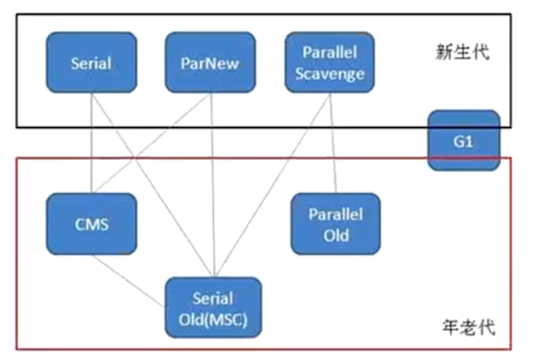

### GC垃圾回收前需要判断对象是否存活
- 引用计数算法
- 可达性分析算法(Hotspot VM采用该种算法)

下图为可达性分析算法的图解：
 

在Java中，哪些可以作为GC Roots的对象：

- 方法区：类静态属性应用的对象
- 方法区：常量引用的对象
- 虚拟机栈(本地变量表)中引用的对象
- 本地方法栈：JNI(Native方法)中引用的对象

 
### Java的引用分类

- 强引用：   
  Object obj = new Object(); 我们使用的引用基本上都是强引用
- 软引用：SoftReference    
  一些有用，但是并非必需，用软引用关联的对象，系统将要发生 `OOM` 前，这些对象就会被回收。
- 弱引用：WeakReference  
  一些有用，但是并非必须，用弱引用关联的对象，只能存活到下次垃圾回收之前，GC发生时，不管内存够不够，都会被回收  
- 虚引用：PhantomReference  
  幽灵引用，最弱，被垃圾回收的时候收到一个通知  

软引用代码实例

```java
package com.liyong.gc;

import java.lang.ref.SoftReference;
import java.util.ArrayList;
import java.util.List;

public class TestSoftReference {
	private static class User {
		private Long userId;
		private String name;
		public User(Long userId, String name) {
			super();
			this.userId = userId;
			this.name = name;
		}
	}
	
	public static void main(String[] args) {
		User user = new User(1000L, "Hello");
		// 将user对象进行软引用
		SoftReference<User> userSoft = new SoftReference<>(user);
		// 取消对user对象的引用
		user = null;
		System.out.println(userSoft.get());
		// 手动发起GC调度请求
		System.gc();
		System.out.println(userSoft.get());
		
		List<Object> list = new ArrayList<>();
		try {
			for (int i = 0; i < 10; i++) {
				System.out.println("foreach start -------: " + userSoft.get());
				// 每次放1M大小的字节到List中
				list.add(new byte[1024*1024*1]);
			}
		} catch (Throwable e) {
			e.printStackTrace();
			System.out.println("Error -------: " + userSoft.get());
		}
		
	}
}
```

JVM虚拟机参数
```shell script
-Xms5m 
-Xmx5m 
-XX:+PrintGC
```

控制台输出  
```shell script
com.liyong.gc.TestSoftReference$User@15db9742
[GC (System.gc())  820K->652K(5632K), 0.0759582 secs]
[Full GC (System.gc())  652K->550K(5632K), 0.0056969 secs]
com.liyong.gc.TestSoftReference$User@15db9742
foreach start -------: com.liyong.gc.TestSoftReference$User@15db9742
foreach start -------: com.liyong.gc.TestSoftReference$User@15db9742
foreach start -------: com.liyong.gc.TestSoftReference$User@15db9742
foreach start -------: com.liyong.gc.TestSoftReference$User@15db9742
[GC (Allocation Failure)  3661K->3782K(5632K), 0.0011918 secs]
[GC (Allocation Failure)  3782K->3718K(5632K), 0.0003072 secs]
[Full GC (Allocation Failure)  3718K->3622K(5632K), 0.0048211 secs]
[GC (Allocation Failure)  3622K->3622K(5632K), 0.0005990 secs]
[Full GC (Allocation Failure)  3622K->3600K(5632K), 0.0043405 secs]
Error -------: null
java.lang.OutOfMemoryError: Java heap space
	at com.liyong.gc.TestSoftReference.main(TestSoftReference.java:34)
```

> 手动调用了`System.gc()`后，进行了一个Full GC，再打印软引用时，引用依旧存在；
> For循环期间每次都在，当抛出OOM错误时，在catch中软引用已经为空。

弱引用  
Java代码：
```java
package com.liyong.gc;

import java.lang.ref.WeakReference;

public class TestWeakReference {
	private static class User {
		private Long userId;
		private String name;
		public User(Long userId, String name) {
			super();
			this.userId = userId;
			this.name = name;
		}
	}
	
	public static void main(String[] args) {
		User user = new User(1000L, "Hello");
		// 将user对象进行软引用
		WeakReference<User> userSoft = new WeakReference<>(user);
		// 取消对user对象的引用
		user = null;
		System.out.println(userSoft.get());
		// 手动发起GC调度请求
		System.gc();
		System.out.println(userSoft.get());
	}
}
```

输出结果  
```shell script
com.liyong.gc.TestWeakReference$User@15db9742
[GC (System.gc())  821K->684K(5632K), 0.0104242 secs]
[Full GC (System.gc())  684K->550K(5632K), 0.0155235 secs]
null
```

> 通过输出可见，在进行GC之后，弱引用就回收了

### 垃圾回收算法
标记-清除算法(Mark-Sweep)
.png) 

复制算法(Copying)
.png) 

> `标记-清除`算法会产生空间碎片，但是回收速度较快；
> `复制`算法，不会产生空间碎片，内存很整齐，但是会浪费一般空间，用于复制 

`Hotspot VM`则是使用了这两种算法

分代收集：  
 

新生代、老年代的收集器是配合使用的。  
图中的连线，代表新生代、老年代使用垃圾回收器的对应关系，新生代、老年代的垃圾回收器不是任意组合的。

> 1、老年代想使用 `CMS` 那么新生代只能使用 `Serial` `PerNew`。
> 因为CMS是标记清除算法，会发生很多空间碎片，所以经过多次GC后，因为部分空间不连续，无法被再次分配到。
> 所以当内存达到一定阀值后，`Serial Old` 会被启用，从而进行Full GC，这个时候会`Stop The World`。  
>
> 2、老年代想使用`Parallel Old`时，新生代只能使用`Parallel Scavenge`。
> 当然`Parallel Scavenge`和`Parallel Old`是JDK8的默认垃圾收集器。  
>
> 3、新生代中复制算法；而老年代CMS使用的标记清除算法； Serial Old(MSC)使用的是复制整理算法； 
> TODO 针对不同的垃圾回收机制整理实现算法
>
> 3、`G1`垃圾收集器收集所有堆空间。

根据统计，90%的对象都是朝生夕死，所以只有10%左右的对象才不会被回收。
所以在新生代中使用`标记-复制`算法的时候，并不是将所有内存一分为二的。

新生代分： Eden / Survivor  有两个Survivor   

默认空间分配比例是   8:1:1  Eden : Survivor From : Survivor To  

回收过程是： Eden From  中的存活对象 复制到 To 中，回收完后， From To 区域的标识互换，即 原来的To变成了From，而原来的From变成了To

新生代的GC叫 Minor GC； 老年代GC叫Full GC

### JDK的垃圾收集器

| 收集器	| 收集对象和算法	| 收集器类型	| 说明	| 适用场景 |
| ----  |  ----         |   ----    | ----  | ----    | 
| Serial |	新生代，复制算法 |	单线程	| |	"简单高效<br>适合内存不大的情况" |
| ParNew	| 新生代，复制算法	| 并行的多线程收集器	| ParNew垃圾收集器是Serial收集器的多线程版本	| 配合CMS垃圾收集器的首选| 
| Parallel Scavenge	| 新生代，复制算法	| 并行的多线程收集器	| 类似ParNew，更加关注吞吐量。<br>达到一个可控的吞吐量<br>是Server级别多CPU机器上的默认GC方式<br>主要适合后台运算，不需要太多交互的任务| 
| Serial Old	| 老年代，标记整理算法	| 单线程		| Client模式下虚拟机使用| 
| Parallel Old	| 老年代，标记整理算法	| 并行的多线程收集器	| Parallel Scavenge收集器的老年代版本，为了配合Parallel Scavenge的面向吞吐量的特性而开发的对应组合	在注重吞吐量以及CPU密集型的场合使用| 
| CMS	| 老年代，标记清除算法	| 并发与并行收集器	| "尽可能的缩短垃圾收集时用户线程停止时间；缺点在于：<br>1、存在内存碎片<br>2、需要更多的CPU资源<br>3、浮动垃圾问题，需要更大的空间"	| 重视服务的响应速度、<br>系统停顿时间和用户体验的互联网网站或者B/S系统。<br>互联网后端目前CMS是主流的垃圾收集器| 
| G1	| 跨新生代和老年代；<br>标记整理+化整为零| 并发与并行收集器| JDK1.7才正式引入，采用分区回收的思维，<br>基本不牺牲吞吐量的前提下完成低停顿的内存回收；<br>可预测的停顿是其最大的优势。	| 面向服务端应用的垃圾收集器，目标为取代CMS| 

 

> 吞吐量 = 运行用户代码时间 / (运行用户代码时间 + 垃圾收集时间)  
> 垃圾收集时间 = 垃圾回收率 * 单词垃圾回收时间  
> 并行： 垃圾收集的多相处同时回收    
> 并发： 垃圾收集器的多线程和应用的多线程同时进行  

查看机器的JVM垃圾回收机制：  

```shell script
E:\>java -XX:+PrintCommandLineFlags -version
-XX:InitialHeapSize=266915840 -XX:MaxHeapSize=4270653440 -XX:+PrintCommandLineFlags -XX:+UseComprividualAllocation -XX:+UseParallelGC
java version "1.8.0_05"
Java(TM) SE Runtime Environment (build 1.8.0_05-b13)
Java HotSpot(TM) 64-Bit Server VM (build 25.5-b02, mixed mode)

E:\>
```

> 从结果 `-XX:+UseParallelGC` 可得出我当前PC机器的垃圾收集器是 `Parallel Scavenge` 和 `Parallel Old`


