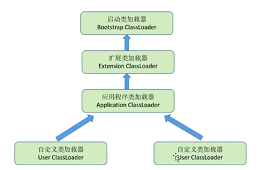

### Class类文件结构
- Java跨平台的基础
- Class的本质
> - Class文件是一组以8字节为基础单位的二进制流
> - 类似于结构体的伪结构来存储数据
> - 无符号数属于基本的数据类型，以 u1 u2 u4 u8
> - 表是由多个无符号数或者其他表作为数据项构成的复合数据类型

> 参考文档： https://juejin.im/post/5d884c766fb9a06ae76444dc  这个地址对class中的各个组成部分有详细讲解。  
> 
> class字节码可视化解析工具`Classpy`： https://github.com/zxh0/classpy

--- 


Class文件格式：
```shell script
ClassFile {
  u4              magic; # 魔数：占用4个字节的无符号数，固定为0xCA_FE_BA_BE，用来标识该文件是class文件
  u2              minor_version;
  u2              major_version;
  u2              constant_pool_count;
  cp_info         constant_pool[constant_pool_count-1];
  u2              access_flags;
  u2              this_class;
  u2              super_class;
  u2              interface_count;
  u2              interface[interface_count];
  u2              fields_count;
  field_info      fields[fields_count];
  u2              methods_count;
  method_info     methods[methods_count];
  u2              attributes_count;
  attribute_info  attributes[attributes_count];
}
```
如上面的代码，class文件主要包括：magic、minor version、major version、constant pool、access flags、
this class、super class、interface class、fields、methods、attribute 11个部分组成。

通过源码来对class进行分析：
定义一个接口：
```java
package com.liyong.system;

public interface Human {
	void walk();
}
```

定义一个抽象类：
```java
package com.liyong.system;

public abstract class AbstractHuman implements Human {

	@Override
	public void walk() {
		System.out.println("walking....");
	}
	
	protected abstract void doSomething();

}
```

再定义一个接口：
```java
package com.liyong.system;

public interface IGreeting {
	void sayHello(String msg);
	void work(String task1, String task2);
}
```

写一个实现类：
```java
package com.liyong.system;

public class ShowBinaryCode extends AbstractHuman implements IGreeting {
	private String name;
	private int age;

	public ShowBinaryCode() {
	}

	public ShowBinaryCode(String name, int age) {
		super();
		this.name = name;
		this.age = age;
	}

	public static void main(String[] args) {
		ShowBinaryCode code = new ShowBinaryCode();
		code.setName("Li");
		code.setAge(100);
		System.out.println("code: " + code);
	}

	public String getName() {
		return name;
	}

	public void setName(String name) {
		this.name = name;
	}

	public int getAge() {
		return age;
	}

	public void setAge(int age) {
		this.age = age;
	}

	private long distance;
	private Object body;
	private float consume;
	private double salary;

	public long getDistance() {
		return distance;
	}

	public void setDistance(long distance) {
		this.distance = distance;
	}

	public Object getBody() {
		return body;
	}

	public void setBody(Object body) {
		this.body = body;
	}

	public float getConsume() {
		return consume;
	}

	public void setConsume(float consume) {
		this.consume = consume;
	}

	public double getSalary() {
		return salary;
	}

	public void setSalary(double salary) {
		this.salary = salary;
	}

	@Override
	public void sayHello(String msg) {
		System.out.println("msg: " + msg);
	}

	@Override
	public void work(String task1, String task2) {
		System.out.println(task1 + " -->  " + task2);
	}

	@Override
	protected void doSomething() {
		System.out.println("do something");
	}
}
```

> 这里设计`Human`接口，再设计一个抽象类`AbstractHuman`并实现`Human`。
> 在设计一个接口`IGreeting`。
> 编写一个实现类`ShowBinaryCode`继承`AbstractHuman`，实现`IGreeting`。

直接通过反编译工具，反编译`ShowBinaryCode`类  
工具：IntelliJ IDEA 2020.1 x64，直接打开class进行反编译  
```java
//
// Source code recreated from a .class file by IntelliJ IDEA
// (powered by Fernflower decompiler)
//

package com.liyong.system;

public class ShowBinaryCode extends AbstractHuman implements IGreeting {
    private String name;
    private int age;
    private long distance;
    private Object body;
    private float consume;
    private double salary;

    public ShowBinaryCode() {
    }

    public ShowBinaryCode(String name, int age) {
        this.name = name;
        this.age = age;
    }

    public static void main(String[] args) {
        ShowBinaryCode code = new ShowBinaryCode();
        code.setName("Li");
        code.setAge(100);
        System.out.println("code: " + code);
    }

    public String getName() {
        return this.name;
    }

    public void setName(String name) {
        this.name = name;
    }

    public int getAge() {
        return this.age;
    }

    public void setAge(int age) {
        this.age = age;
    }

    public long getDistance() {
        return this.distance;
    }

    public void setDistance(long distance) {
        this.distance = distance;
    }

    public Object getBody() {
        return this.body;
    }

    public void setBody(Object body) {
        this.body = body;
    }

    public float getConsume() {
        return this.consume;
    }

    public void setConsume(float consume) {
        this.consume = consume;
    }

    public double getSalary() {
        return this.salary;
    }

    public void setSalary(double salary) {
        this.salary = salary;
    }

    public void sayHello(String msg) {
        System.out.println("msg: " + msg);
    }

    public void work(String task1, String task2) {
        System.out.println(task1 + " -->  " + task2);
    }

    protected void doSomething() {
        System.out.println("do something");
    }
}
```


通过工具`Classpy`对class文件解析如下图：


通过`Classpy`可以清楚地看到一个class组成部分是固定的，就是11个部分。

1. magic  

魔数：占用4个字节的无符号数，固定为0xCA_FE_BA_BE，用来标识该文件是class文件

2. minor version

次版本号：占两个字节的无符号数，范围0～65535，与major version一起表示当前class文件的版本.。
jvm可以向前兼容之前的版本，但不能向后兼容，即jdk7的虚拟机不能运行jdk8编译的class

3. major version  

主版本号： 占两个字节的无符号数，jdk1.1使用的主版本号是45，以后每个大版本加1，如jdk1.8为52

4. constant pool  

通过`constants_pool_count`确认了常量池中常量的数量。
  
常量池： 常量池是class中十分重要的一部分，它可不是只保存着类中定义的常量而已，还保存着class文件中的各种元数据，
包括一些字符串，类名，接口名，字段名，方法名等等……，
它的作用就是被引用，常量池部分首先2个字节u2记录它包含的常量个数。

> 常量池就是一系列的数组，它的下标是从1开始的，即有效大小是constants_pool_count-1，
> 第0项是无效的，有些结构可以用索引0来标识没哟对应常量的引用。

> 常量池的设计有效的减小了class文件的大小，所有需要使用比如类名、方法名等的地方都只需要u2来标识其名称所在的索引即可。


constant分类：  
对于不同的constant,在class中使用tag来表示不同类型的constant。    
---
tag = 1  
```shell script
CONSTANT_Utf8_info {
    u1 tag;
    u2 length;
    u1 bytes[length];
}
```
  
```shell script
CONSTANT_Utf8 {
    tag: 1;
    length: 32;
    bytes: com/liyong/system/ShowBinaryCode;
}
```

---
tag=3  
```shell script
CONSTANT_Integer {
    u1 tag;
    u4 bytes;
}
```
  
```shell script
CONSTANT_Integer {
    tag: 3;
    bytes: 18;
}
```
> - int，tag=3，接下来4个字节表示该int的值。  
> - java中short, char, byte, boolean使用int来表示，boolean数组则用byte数组来表示（1个byte表示1个boolean元素）

---
tag=4
结构： 
```shell script
CONSTANT_Float {
  u1 tag;
  u4 bytes;
}
```
实例图片：
  
```shell script
CONSTANT_Integer {
    tag: 4;
    bytes: 1148846408;
}
```
> 该float的值为1000.02，但是是float型，第一位是符号位，8位是指数位，23位是尾数为，这个现实是`Classpy`的显示bug。

---
tag=5
结构：
```shell script
CONSTANT_Long {
  u1 tag;
  u4 high_bytes;
  u4 low_bytes;
}
```
实例图片
 
```shell script
CONSTANT_Long {
  tag 5;
  high_bytes: 0x00_00_00_00;
  low_bytes: 0x00_00_03_E8;
}
```
---
tag=6
```shell script
CONSTANT_Double {
    u1 tag;
    u4 high_bytes;
    u4 low_bytes;
}
```

> tag=6，双精度浮点数


---
tag=7
```shell script
CONSTANT_Class {
    u1 tag;
    u2 name_index;
}
```


> 表示一个类或接口，注意不是field的类型或method的参数类型、返回值类型。
> name_index是常量池索引，该索引处常量肯定是一个CONSTANT_Utf8_info

---
tag=8
```shell script
CONSTANT_String {
    u1 tag;
    u2 string_index;
}
```


> tag=8，表示一个常量字符串，string_index是常量池索引，
> 该索引处常量肯定是一个CONSTANT_Utf8_info，存储着该字符串的值

---
tag=9
```shell script
CONSTANT_Fieldref {
    u1 tag;
    u2 class_index;
    u2 name_and_type_index;
}
```

> class_index是常量池中一个CONSTANT_Class类型常量（类／接口）索引，表示field所属类。
> name_and_type_index是常量池中一个CONSTANT_NameAndType（见下文）类型常量索引，表示field的名称和类型。
 

---
tag=10
```shell script
CONSTANT_Methodref {
  u1 tag;
  u2 class_index;
  u2 name_and_type_index;
}
```


> tag=10，表示一个引用method信息，实例method。
> class_index是常量池中一个CONSTANT_Class_info类型常量（这里只能是类）索引，表示method所属类。
> name_and_type_index是常量池中一个CONSTANT_NameAndType_info类型常量索引，表示method的名称和参数，返回值信息。


---
tag=11


---
tag=12
```shell script
CONSTANT_NameAndType {
    u1 tag;
    u2 name_index;
    u2 descriptor_index;
}
```

> tag=12，存储`field`或`method`的名称，类型等信息，可以看出它又是两个引用。
> name_index指向一个CONSTANT_Utf8_info，表示字段或方法的非全限定名称。
> descriptor_index也指向一个CONSTANT_Utf8_info，表示该`field`或`method`的描述信息。
  

---
descriptor
descriptor用一个字符串CONSTANT_Utf8_info保存。

字段描述符（FieldType），FieldType可以是基本类型：
- B(byte)
- C(char)
- D(double)
- F(float)
- I(int)
- J(long)
- S(short)
- Z(boolean)
- 对象类型：L+全限定类名
- 数组类型：[+元素类型
```java
int a; // I
Integer b; //Ljava/lang/Integer
double[] c; //[D
double[][] d; //[[D
Object[] e; //[Ljava/lang/Object
Object[][][] f; //[[[Ljava/lang/Object
```


---
tag=15
```shell script
CONSTANT_MethodHandler {
  u1 tag;
  u1 reference_kind;
  u2 reference_index;
}
```
> tag=15，方法句柄，比如获取一个类静态字段，实例字段，调用一个方法，构造器等都会转化成一个句柄引用。

---
tag=16


---
tag=18


---


5. access flags  
access flags表示类，接口，字段，方法的访问控制和修饰信息。

| Access Flag(u2) | Value | 作用对象 |
| ---- | ---- | ---- |
| ACC_PUBLIC | 0x0001 | class, inner, field, method |
| ACC_PRIVATE | 0x0002 | inner, field, method |
| ACC_PROTECTED | 0x0004 | inner, field, method |
| ACC_STATIC | 0x0008 | inner, field, method |
| ACC_FINAL | 0x0010 | class, inner, field, method |
| ACC_SUPER | 0x0020 | class |
| ACC_SYNCHRONIZED | 0x0020 | method |
| ACC_VOLATILE | 0x0040 | field |
| ACC_BRIDGE | 0x0040 | method |
| ACC_TRANSIENT | 0x0080 | field |
| ACC_VARARGS | 0x0080 | method |
| ACC_NATIVE | 0x0100 | method |
| ACC_INTERFACE | 0x0200 | class, inner |
| ACC_ABSTRACT | 0x0400 | class, inner, method |
| ACC_STRICT | 0x0800 | method |
| ACC_SYNTHETIC | 0x1000 | class, inner, field, method |
| ACC_ANNOTATION | 0x2000 | class, inner |
| ACC_ENUM | 0x4000 | class, inner, field |

- ACC_SUPER：用于invokespecial指令而需要特殊处理的父类方法
- ACC_BRIDGE：桥方法标志，有该标志的方法上同时有ACC_SYNTHETIC标志
- ACC_STRICT：strictfp，strict float point，方法使用 FP-strict 浮点格式
- ACC_SYNTHETIC：标志是由编译器生成的，源码中并没有

6. this class
当前类或接口，指向一个CONSTANT_Class_info常量，可以从中解析当前类的全限定名称。
包名层次用/分割，而不是.，如java/lang/Object。

7. super class

8. interfaces

9. fields
```shell script
field {
  u2              access_flags;
  u2              name_index;
  u2              descriptor_index;
  u2              attributes_count;
  attribute_info  attributes[attributes_count];
}
```


### 字节码指令集

指令 1 字节 （0 ~ 255）256个特地的数字，指令数不能超过256个

> 参考地址： https://kknews.cc/code/za6a8ng.html


| 指令集大类 | 指令 | 描述 |
| ---- | ---- | ---- |
| 将常量压入栈 | aconst_null | 将null常量对象引用压入栈 |
|  | iconst_m1 | 将int类型常量-1压入栈 |
|  | iconst_0 | 将int类型常量0压入栈 |
|  | iconst_1 | 将int类型常量1压入栈 |
|  | lconst_0 | 将long类型常量0压入栈 |
|  | lconst_1 | 将long类型常量1压入栈 |
|  | fconst_0 | 将float类型常量0压入栈 |
|  | fconst_1 | 将float类型常量1压入栈 |
|  | dconst_0 | 将double类型常量0压入栈 |
|  | dconst_1 | 将double类型常量1压入栈 |
| 将基本类型压入栈 | bipush 59 | 将一个8位带符号整数压入栈（59的数值） |
|  | sipush 300 | 将16位带符号整数压入栈（300的数值） |
|  | ldc    | 把常量池中的项压入栈 |
|  | ldc_w  | 把常量池中的项压入栈（使用宽索引） |
|  | ldc2_w | 把常量池中long类型或者double类型的项压入栈（使用宽索引） |
| 从栈中的局部变量中装载值的指令 | iload | 从局部变量中装载的int类型值 |
|  | lload | 从局部变量中装载long类型值 |
|  | fload | 从局部变量中装载float类型值 |
|  | dload | 从局部变量中装载double类型值 |
|  | aload | 从局部变量中装载引用类型值（refernce） |
|  | iload_0 | 从局部变量0中装载int类型值 |
|  | iload_2 | 从局部变量2中装载int类型值 |
|  | lload_3 | 从局部变量3中装载long类型值 |
|  | fload_2 | 从局部变量2中装载float类型值 |
|  | dload_2 | 从局部变量2中装载double类型值 |
|  | aload_0 | 从局部变量0中装载引用类型值 |
| 从数组中装载数据 | iaload | 从数组中装载int类型值 |
|  | laload | 从数组中装载long类型值 |
|  | faload | 从数组中装载float类型值 |
|  | daload | 从数组中装载double类型值 |
|  | aaload | 从数组中装载引用类型值 |
|  | baload | 从数组中装载byte类型或boolean类型值 |
|  | caload | 从数组中装载char类型值 |
|  | saload | 从数组中装载short类型值 |
| wide指令 | wide | 使用附加字节扩展局部变量索引 |
| 通用(无类型）栈操作 | nop     | 不做任何操作                                                             |
|  | pop     | 弹出栈顶端一个字长的内容                                                 |
|  | pop2    | 弹出栈顶端两个字长的内容                                                 |
|  | dup     | 复制栈顶部一个字长内容                                                   |
|  | dup_x1  | 复制栈顶部一个字长的内容，然后将复制内容及原来弹出的两个字长的内容压入栈 |
|  | dup_x2  | 复制栈顶部一个字长的内容，然后将复制内容及原来弹出的三个字长的内容压入栈 |
|  | dup2    | 复制栈顶部两个字长内容                                                   |
|  | dup2_x1 | 复制栈顶部两个字长的内容，然后将复制内容及原来弹出的三个字长的内容压入栈 |
|  | dup2_x2 | 复制栈顶部两个字长的内容，然后将复制内容及原来弹出的四个字长的内容压入栈 |
|  | swap    | 交换栈顶部两个字长内容                                                   |
| 将栈中的值存入局部变量的指令 | istore | 将int类型值存入局部变量 |
|  | lstore   | 将long类型值存入局部变量                      |
|  | fstore   | 将float类型值存入局部变量                     |
|  | dstore   | 将double类型值存入局部变量                    |
|  | astore   | 将将引用类型或returnAddress类型值存入局部变量 |
|  | istore_0 | 将int类型值存入局部变量0                      |
|  | istore_1 | 将int类型值存入局部变量1                      |
|  | istore_2 | 将int类型值存入局部变量2                      |
|  | lstore_0 | 将long类型值存入局部变量0                     |
|  | fstore_1 | 将float类型值存入局部变量1                    |
|  | dstore_2 | 将double类型值存入局部变量2                   |
|  | astore_0 | 将引用类型或returnAddress类型值存入局部变量0   |
| 将数据存入数组中 | iastore | 将int类型值存入数组中                 |
|  | lastore | 将long类型值存入数组中                |
|  | fastore | 将float类型值存入数组中               |
|  | dastore | 将double类型值存入数组中              |
|  | aastore | 将引用类型值存入数组中                |
|  | bastore | 将byte类型或者boolean类型值存入数组中 |
|  | castore | 将char类型值存入数组中                |
|  | sastore | 将short类型值存入数组中               |
| 基本数据类型转换 | i2l | 把int类型的数据转化为long类型       |
|  | i2f | 把int类型的数据转化为float类型      |
|  | i2d | 把int类型的数据转化为double类型     |
|  | l2i | 把long类型的数据转化为int类型       |
|  | l2f | 把long类型的数据转化为float类型     |
|  | l2d | 把long类型的数据转化为double类型    |
|  | f2i | 把float类型的数据转化为int类型      |
|  | f2l | 把float类型的数据转化为long类型     |
|  | f2d | 把float类型的数据转化为double类型   |
|  | d2i | 把double类型的数据转化为int类型     |
|  | d2l | 把double类型的数据转化为long类型    |
|  | d2f | 把double类型的数据转化为float类型   |
|  | i2b | 把int类型的数据转化为byte类型       |
|  | i2c | 把int类型的数据转化为char类型       |
|  | i2s | 把int类型的数据转化为short类型      |
| 逻辑运算-整数运算 | iadd | 执行int类型的加法                       |
|  | ladd | 执行long类型的加法                      |
|  | isub | 执行int类型的减法                       |
|  | lsub | 执行long类型的减法                      |
|  | imul | 执行int类型的乘法                       |
|  | lmul | 执行long类型的乘法                      |
|  | idiv | 执行int类型的除法                       |
|  | ldiv | 执行long类型的除法                      |
|  | irem | 计算int类型除法的余数                   |
|  | lrem | 计算long类型除法的余数                  |
|  | ineg | 对一个int类型值进行取反操作             |
|  | lneg | 对一个long类型值进行取反操作            |
|  | iinc | 把一个常量值加到一个int类型的局部变量上 |
| 逻辑运算-浮点运算 | fadd | 执行float类型的加法        |
|  | dadd | 执行double类型的加法       |
|  | fsub | 执行float类型的减法        |
|  | dsub | 执行double类型的减法       |
|  | fmul | 执行float类型的乘法        |
|  | dmul | 执行double类型的乘法       |
|  | fdiv | 执行float类型的除法        |
|  | ddiv | 执行double类型的除法       |
|  | frem | 计算float类型除法的余数    |
|  | drem | 计算double类型除法的余数   |
|  | fneg | 将一个float类型的数值取反  |
|  | dneg | 将一个double类型的数值取反 |
| 逻辑运算-移位操作 | ishl  | 执行int类型的向左移位操作       |
|  | lshl  | 执行long类型的向左移位操作      |
|  | ishr  | 执行int类型的向右移位操作       |
|  | lshr  | 执行long类型的向右移位操作      |
|  | `iushr` | 执行int类型的向右逻辑移位操作   |
|  | `lushr` | 执行long类型的向右逻辑移位操作  |
| 逻辑运算-按位布尔运算 | iand | 对int类型值进行“逻辑与”操作      |
|  | land | 对long类型值进行“逻辑与”操作     |
|  | ior  | 对int类型值进行“逻辑或”操作      |
|  | lor  | 对long类型值进行“逻辑或”操作     |
|  | ixor | 对int类型值进行“逻辑异或”操作    |
|  | lxor | 对long类型值进行“逻辑异或”操作   |
| 对象操作指令 | new            | 创建一个新对象                             |
|  | checkcast      | 确定对象为所给定的类型                     |
|  | getfield       | 从对象中获取字段                           |
|  | putfield       | 设置对象中字段的值                         |
|  | getstatic      | 从类中获取静态字段                         |
|  | putstatic      | 设置类中静态字段的值                       |
|  | instanceof     | 判断对象是否为给定的类型                   |
| 数组操作指令 | newarray       | 分配数据成员类型为基本上数据类型的新数组   |
|  | anewarray      | 分配数据成员类型为引用类型的新数组         |
|  | arraylength    | 获取数组长度                               |
|  | multianewarray | 分配新的多维数组                           |
| 控制流-条件分支指令 | ifeq      | 如果等于0，则跳转                                       |
|  | ifne      | 如果不等于0，则跳转                                     |
|  | iflt      | 如果小于0，则跳转                                       |
|  | ifge      | 如果大于等于0，则跳转                                   |
|  | ifgt      | 如果大于0，则跳转                                       |
|  | ifle      | 如果小于等于0，则跳转                                   |
|  | if_icmpcq | 如果两个int值相等，则跳转                               |
|  | if_icmpne | 如果两个int类型值不相等，则跳转                         |
|  | if_icmplt | 如果一个int类型值小于另外一个int类型值，则跳转          |
|  | if_icmpge | 如果一个int类型值大于或者等于另外一个int类型值，则跳转  |
|  | if_icmpgt | 如果一个int类型值大于另外一个int类型值，则跳转          |
|  | if_icmple | 如果一个int类型值小于或者等于另外一个int类型值，则跳转  |
|  | ifnull    | 如果等于null，则跳转                                    |
|  | ifnonnull | 如果不等于null，则跳转                                  |
|  | if_acmpeq | 如果两个对象引用相等，则跳转                            |
|  | if_acmpnc | 如果两个对象引用不相等，则跳转                          |
| 控制流-比较指令 | lcmp  | 比较long类型值                           |
|  | fcmpl | 比较float类型值（当遇到NaN时，返回-1）   |
|  | fcmpg | 比较float类型值（当遇到NaN时，返回1）    |
|  | dcmpl | 比较double类型值（当遇到NaN时，返回-1）  |
|  | dcmpg | 比较double类型值（当遇到NaN时，返回1）   |
| 控制流-无条件转移指令 | goto   | 无条件跳转           |
|  | goto_w | 无条件跳转（宽索引） |
| 控制流-表跳转指令 | tableswitch  | 通过索引访问跳转表，并跳转              |
|  | lookupswitch | 通过键值匹配访问跳转表，并执行跳转操作  |
| 控制流-异常 | athrow  | 抛出异常或错误         |
|  | finally | 子句                   |
|  | jsr     | 跳转到子例程           |
|  | jsr_w   | 跳转到子例程（宽索引） |
|  | rct     | 从子例程返回           |
| 方法调用指令 | invokcvirtual   | 运行时按照对象的类来调用实例方法 |
|  | invokespecial   | 根据编译时类型来调用实例方法     |
|  | invokestatic    | 调用类（静态）方法               |
|  | invokcinterface | 调用接口方法                     |
| 方法返回指令 | ireturn | 从方法中返回int类型的数据     |
|  | lreturn | 从方法中返回long类型的数据    |
|  | freturn | 从方法中返回float类型的数据   |
|  | dreturn | 从方法中返回double类型的数据  |
|  | areturn | 从方法中返回引用类型的数据    |
|  | return  | 从方法中返回，返回值为void    |
| 线程同步 | monitorenter | 进入并获取对象监视器  |
|  | monitorexit  | 释放并退出对象监视器  |


JVM指令助记符

| 指令集大类 | 指令 |
| ---- | ---- |
| 变量到操作数栈：            | iload,iload_,lload,lload_,fload,fload_,dload,dload_,aload,aload_
| 操作数栈到变量：            | istore,istore_,lstore,lstore_,fstore,fstore_,dstore,dstor_,astore,astore_                                                                                    |
| 常数到操作数栈：            | bipush,sipush,ldc,ldc_w,ldc2_w,aconst_null,iconst_ml,iconst_,lconst_,fconst_,dconst_                                                                         |
| 加：                        | iadd,ladd,fadd,dadd                                                                                                                                          |
| 减：                        | isub,lsub,fsub,dsub                                                                                                                                          |
| 乘：                        | imul,lmul,fmul,dmul                                                                                                                                          |
| 除：                        | idiv,ldiv,fdiv,ddiv                                                                                                                                          |
| 余数：                      | irem,lrem,frem,drem                                                                                                                                          |
| 取负：                      | ineg,lneg,fneg,dneg                                                                                                                                          |
| 移位：                      | ishl,lshr,iushr,lshl,lshr,lushr                                                                                                                              |
| 按位或：                    | ior,lor                                                                                                                                                      |
| 按位与：                    | iand,land                                                                                                                                                    |
| 按位异或：                  | ixor,lxor                                                                                                                                                    |
| 类型转换：                  | i2l,i2f,i2d,l2f,l2d,f2d(放宽数值转换)                                                                                                                        |
|                             | i2b,i2c,i2s,l2i,f2i,f2l,d2i,d2l,d2f(缩窄数值转换)                                                                                                            |
| 创建类实便：                | new                                                                                                                                                          |
| 创建新数组：                | newarray,anewarray,multianwarray                                                                                                                             |
| 访问类的域和类实例域：      | getfield,putfield,getstatic,putstatic                                                                                                                        |
| 把数据装载到操作数栈：      | baload,caload,saload,iaload,laload,faload,daload,aaload                                                                                                      |
| 从操作数栈存存储到数组：    | bastore,castore,sastore,iastore,lastore,fastore,dastore,aastore                                                                                              |
| 获取数组长度：              | arraylength                                                                                                                                                  |
| 检相类实例或数组属性：      | instanceof,checkcast                                                                                                                                         |
| 操作数栈管理：              | pop,pop2,dup,dup2,dup_xl,dup2_xl,dup_x2,dup2_x2,swap                                                                                                         |
| 有条件转移：                | ifeq,iflt,ifle,ifne,ifgt,ifge,ifnull,ifnonnull,if_icmpeq,if_icmpene,if_icmplt,if_icmpgt,if_icmple,if_icmpge,if_acmpeq,if_acmpne,lcmp,fcmpl,fcmpg,dcmpl,dcmpg |
| 复合条件转移：              | tableswitch,lookupswitch                                                                                                                                     |
| 无条件转移：                | goto,goto_w,jsr,jsr_w,ret                                                                                                                                    |
| 调度对象的实便方法：        | invokevirtual                                                                                                                                                |
| 调用由接口实现的方法：      | invokeinterface                                                                                                                                              |
| 调用需要特殊处理的实例方法：| invokespecial                                                                                                                                                |
| 调用命名类中的静态方法：    | invokestatic                                                                                                                                                 |
| 方法返回：                  | ireturn,lreturn,freturn,dreturn,areturn,return                                                                                                               |
| 异常：                      | athrow                                                                                                                                                       |
| finally关键字的实现使用：   | jsr,jsr_w,ret                                                                                                                                                |


#### 基于栈的字节码解释执行引擎
- 基于栈的指令集 与 基于寄存器的指令集
- 基于栈的解释执行过程：
```java
public class Test {
    // TODO ...
    public int calc () {
        int a = 100;
        int b = 200;
        int c = 300;
        return (a + b) * c;
    }
}
```

#### 类记载机制


类加载的三件事：
1. 加载类的二进制流  
2. 把静态存储结构转换为方法区的运行时结构
3. 生成一个代表这个类的Class对象

> 准备阶段做内存分配，比如 static int 设置为0  
> 初始化阶段执行类的构造器 <clinit>, 初始化过程，按照源码流程，如果没有静态属性，编译器不会生成 <clinit> 指令 

类的初始化，有且仅有5种情况才必须对类进行初始化：
- new, getstatic, putstatic, invokestatic
- 对类进行反射调用
- 初始化一个类，如果父类还有初始化的时候，先触发父类的初始化
- 指定一个执行main的类，初始化主类
- 动态语言支持

```java
package com.liyong.system;

public class SuperClazz {
    static {
        System.out.println("super class init");
    }
    
    public static int value = 123;
    public static final String HELLO_WORLD = "Hello, world!";
    public static final int WHAT = value;
}
```

```java
package com.liyong.system;

public class SubClazz extends SuperClazz {
    static {
        System.out.println("sub class init");
    }   
}
```

```java
package com.liyong.system;

public class Main {
    public static void main(String[] args) {
        System.out.println(SubClazz.value);
    }
}
```
输出结果：
```shell script
super class init
123
```

> 总结： 通过子类引用父类的静态变量，父类Class初始化了，而子类的Class没有初始化

```java
package com.liyong.system;

public class Main {
    public static void main(String[] args) {
        SuperClazz[] sca = new SuperClazz[10];
    }
}
```
> 总结，上面的这段代码没有输出结果，父类Class的数组申明没有任何Class初始化

```java
package com.liyong.system;

public class Main {
    public static void main(String[] args) {
    	System.out.println(SubClazz.HELLO_WORLD);
    }
}
```

输出结果：
```shell script
Hello, world!
```

> 总结：两个类都没有进行初始化，字符串常量在编译时，直接编译到Main.class中了。

```java
package com.liyong.system;

public class Main {
    public static void main(String[] args) {
    	System.out.println(SubClazz.WHAT);
    }
}
```
输出结果：
```shell script
super class init
123
```
> 总结：super class初始化了，引用了SuperClazz的非字符串常量。


#### 类加载器
> 用途：热加载、代码保护和加解密、类层次划分、OSGI等  

系统的类加载器： 
 
| 类加载器名称 | 加载的范围 |
| ---- | ---- |
| 启动类加载器：Bootstrap ClassLoader | 存放在 `<JAVA_HOME>\jre\lib` `<JAVA_HOME>\jre\lib`目录中的，并且是虚拟机识别的类库加载到虚拟机内存 |
| 扩展类加载器：Extension ClassLoader | 存放在 `<JAVA_HOME>\jre\lib\ext` 目录中的所有类库，开发者可以直接使用 |
| 应用程序加载器：Application ClassLoader | 加载用户类路径上执行的类库，开发者可以直接使用，一般情况下这个就是程序中默认的类加载器 |

**双亲委派**

 

- 双亲委派模型过程：  
某个特定的类加载器在接到加载类的请求时，首先将加载任务委托给父类加载器，一次递归，若父类加载器可以完成加载任务就成功返回；
只有父类加载器无法完成加载，才自己加载。


